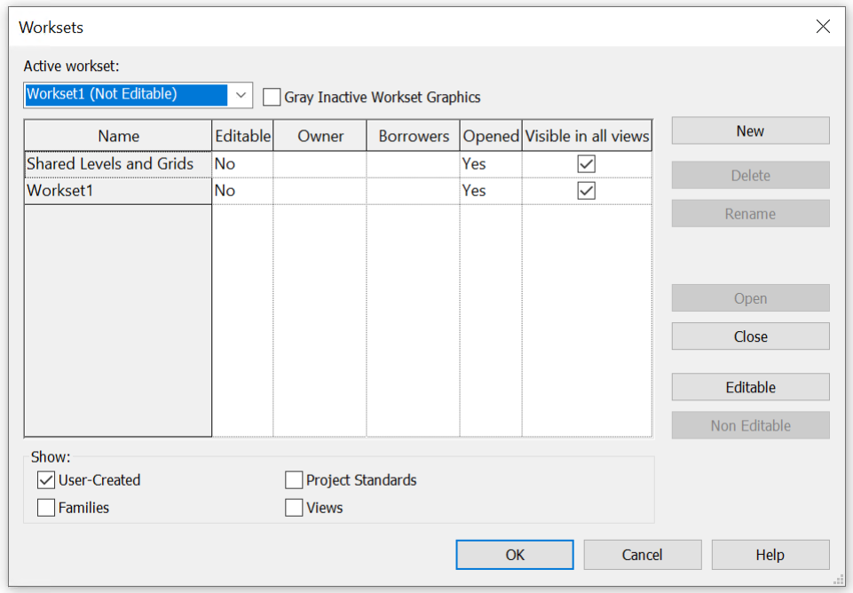

# ATL-STD-XX-DC-GN-001: Information Structure, Naming, and Format Standard

!!! info "Document Information"
    **Standard ID**: ATL-STD-XX-DC-GN-001  
    **Version**: 2.0  
    **Last Updated**: 2026-01-30  
    **Status**: Active

---

## 2 INTRODUCTION

### 2.1 Purpose

This BIM Standard outlines the format, structure and naming of the information. Includes naming standards for documents and plans as well as rooms, doors, and spaces. Refer to the table below for related documents.

| DOCUMENT TITLE | DESCRIPTION | VERSION | DATE |
|----------------|-------------|---------|-------|
| ATL-STD-XX-DC-GN-001 | Information Structure, Naming, and Format Standard. Outlines the format, structure and naming of the information. Includes naming standards for documents and plans as well as rooms, doors, and spaces. | 2.0 | Jan 2026 |
| ATL-STD-XX-DC-GN-002 | P&D BIM Standards. Outlines the information requirements, project workflows, and technical guidelines for BIM implementation. | 2.0 | Jan 2026 |
| ATL-STD-XX-DC-GN-003 | Revit Project Setup with Custom Coordinates. Describe the procedure for initiating a new project utilizing the provided templates. | 2.0 | Jan 2026 |
| ATL-STD-XX-TP-GN-001 | BIM Execution Plan Template. Outlines the project specific BIM strategies and workflows. | 1.0 | July 2025 |
| ATL-STD-XX-TP-GN-002 | Information Delivery Plan Template. The IDP defines what information must be delivered, when it must be delivered, by whom, and in what format. | 1.0 | July 2025 |

In addition to the document, we provide:

| FILE NAME | DESCRIPTION | VERSION | DATE |
|-----------|-------------|---------|------|
| ATL Revit Templates | Standardize project documentation, offer pre-configured environment with standardized settings, views, and sheets | 1.0 | July 2025 |
| ATL Site Model | Allow users to acquire the correct location for the project | 1.0 | July 2025 |
| ATL Concourse Models | This model is a section of the site model, including the grids corresponding to each of the concourses. | 1.0 | July 2025 |
| ATL Border Families | Ensures uniformity in project documents, crucial for P&D's BIM implementation, promoting consistent standards and efficient project delivery | 1.0 | July 2025 |
| P&D Standard Details Library | A library offering standardized construction details across all disciplines for consistency. | 1.0 | July 2025 |

## 3 FILE NAMING CONVENTION 

Information Containers, generally referred to as “filenames” should be formatted to adhere with the general outline from the UK Annex to ISO 19650 that has largely been adopted globally. 

An amended version of the naming convention for filenames is as follows: 

__WBS – Originator – Level – Type – Role – Number __

Note that there are no special characters, spaces, or decimals in the name and the delineation utilizes hyphen-minus.

__*F1021014-ATL-XX-M3-A-001.rvt*__

| Component | Description | Example |
|-----------|-------------|----------|
| Project ID | Project WBS Code | P1234567 |
| Originator | Company or authoring party code | ATL = Atlanta Airport |
| Level | Floor, level, or vertical location | 00 = ground floor; XX= if not appl.; ZZ= multiple |
| Type | File/document type code | DR = Drawing, M3 = 3D model |
| Role | Discipline responsible | A = Architect, S = Structural, etc. |
| Number | Unique identifier | 001, 002, etc. |

*Examples:*

| FILE NAME | WHAT IT IS |
|-----------|------------|
| P12345-ATL-01-DR-S-023.dwg | Exported Drawing from Structural team, Level 01 |
| P12345-ATL-ZZ-M3-M-005.rvt | 3D Model from Mechanical team, Multiple levels |
| P12345-ATL-00-DR-A-001.pdf | Architect's Ground Floor Drawing |
| P12345-ATL-ZZ-DR-C-007.dwg | Civil Drawing with unspecified level (ZZ= multiple levels) |

__NOTE:__

- XX is used if there is no spatial elevation or level that could apply (e.g. details, notes, index, etc.)
- ZZ is used for files that contain information that at multiple levels (e.g. whole facility Revit models or site civil plans)

### 3.1 Role Codes

Here are the disciplines you can apply to your project:

| CODE | DISCIPLINE NAME |
|------|------------------|
| AR | Architectural |
| CV | Civil |
| EL | Electrical |
| NV | Environmental |
| GE | Geotechnical |
| ME | Mechanical |
| FP | Fire Protection |
| PL | Plumbing |
| ST | Structural |
| TR | Traffic |
| RS | Resilience and Sustainable Design |
| VT | Vertical Transportation |
| GN | General/Organizational Information |
| EC | Existing Conditions Model |
| SM | Site Model |
| SU | Survey |

### 3.2 Type Codes

Here are the file types you can apply to your project:

| Code | Description |
|------|-------------|
| M2 | 2D Model |
| M3 | 3D Model (Revit) |
| D1 | Drawing |
| S1 | Schedule |
| M4 | 4D Simulation Model |
| TP | Template |
| DC | Document |
| RP | REPORT |
| EX | EXCHANGE |
| ES | ESTIMATION |
| PR | PRESENTATION |
| SU | SURVEY |

### 3.3 Documents Naming Convention

For documents that belong to a specific project, filenames shall follow the naming convention for Revit files. 

For documents that are considered “General Documents” or documents intended to be used across all projects (e.g. BIM Standards, BEP templates, guidance documents), the filename format shall be:

__Originator-STD-XX-Type-GN-Number__

Where:

- Originator-STD = Organizational/Standard Identifier (ATL-STD)
- XX = No level applicable
- GN = General/Organizational Information

*Example:*

ATL-STD-XX-DC-GN-001.doc     Information Structure, Naming, and Format Standard

### 3.4 ACC Projects Naming Standard

Projects created within Autodesk Construction Cloud (ACC) shall follow a consistent and structured naming convention to ensure clarity, searchability, and alignment with ATL BIM Standards and ISO-based information management practices.

ACC Project Names must use one of the following formats:

1. Standard Format. (Preferred when WBS Exists)

__ATL-WBS-ProjectName-Phase__

| ITEM | DESCRIPTION |
|------|-------------|
| ATL | Originator/Organization Identifier (Atlanta Airport) |
| WBS | The project's work breakdown structure or contract/project code (Example: F1021014, P1234567) |
| ProjectName | A concise, descriptive name using TitleCase with no spaces Hyphens may be used to separate major components (Example: AHUReplacement, ConcourseBExpansion) |
| Phase | The primary project phase or deliverable stage (SD=Schematic Design, DD=Design Development, CD=Construction Document, CA=Construction Administration, Study, AsBuilt, etc.) |

*Example:* 

ATL-F1021014-ConcourseAExpansion-SD

1. Alternate Format (When No WBS Exists)

__ATL-ProjectName-Phase__

Use this format when a WBS code has not yet been assigned or is not applicable.

*Example:*

ATL-LagardereRetail-Concessions-DD

1. Alternate Format (When No WBS or Phase)

__ATL-ProjectName__

Use this format when a WBS code has not yet been assigned or is not applicable and/or there isn’t a single phase.

*Example:*

ATL-PowerDistReplacement-B

### 3.5 Site Models

Site Models are used to stablish consistent project-wide topography, civil features, grid systems, and spatial context across all concourses and project areas. These models ensure alignment of geometry and location data for all design disciplines working with the airport campus.

Site Model filenames shall follow the structure:

Concourse/Zone-Originator-Level-Type-Discipline-Number

Where:

| ITEM | DESCRIPTION |
|------|-------------|
| Concourse | Identifies the facility or concourse the asset belongs to. This is always the first character or set of character. Examples: A, B, C, D, E, F, T, M, etc. |
| ATL | Originator/Organization Identifier (Atlanta Airport). |
| ZZ | Level indicator. “ZZ” is used for models spanning multiple levels or when level is not applicable. |
| M3 | File Type indicating a 3D Revit Model. |
| SM | Discipline code representing Site Model (as per Type Codes and Role Codes tables). |
| Number | A three-digit sequential unique identifier (001, 002, etc.), used when multiple site models exist for phasing or extended site areas. |

*Example: *

A-ATL-ZZ-M3-SM-001.rvt

### 3.6 3D Asset Models

Asset Models created for facilities across Hartsfield-Jackson Atlanta International Airport shall follow a consistent naming standard to support clarity, asset traceability, and alignment with ATL BIM Standards and ISO-based information management practices.

Asset Model filenames shall follow the structure:

__Concourse-Originator-Level-Type-Discipline-Number.rvt__

Where:

| ITEM | DESCRIPTION |
|------|-------------|
| Concourse | Identifies the facility or concourse the asset belongs to. This is always the first character or set of character. Examples: A, B, C, D, E, F, T, M, etc. |
| ATL | Originator/Organization Identifier (Atlanta Airport). |
| ZZ | Level indicator. “ZZ” is used for models spanning multiple levels or when level is not applicable. |
| M3 | File Type indicating a 3D Revit Model. |
| Role | Discipline Code following ATL Role Codes (AR, ST, ME, PL, EL, FP, etc.). |
| Number | A three-digit sequential unique identifier (001, 002, etc.). |

*Example: *

A-ATL-ZZ-M3-AR-001.rvt

### 3.7 3D Model Families Naming Convention

The filename format is: __CATEGORY-MANUFACTURER-DESCRIPTION.rfa__

| ITEM | DESCRIPTION |
|------|-------------|
| Category | Names the element that the family creates |
| Manufacturer | Manufacturer Name or the word “Generic” |
| Description | A brief Description and/or a Model Number |

*Example: *

• WINDOWS-MILGARD-DOUNBLEHUNG400.rfa

#### 3.7.1 Family Types

Family types should highlight the key differences among options.

 Type names can be:

- Model or Series Number
- Value or Capacity
- Width x Depth x Height

*Example: *

• 30inx20in

### 3.8 Annotation Families Naming Convention

Each P&D project template includes various standardized Annotation Families, whose names must remain unchanged. The annotation family name should be formatted as: 

“CI-CATEGORY-DESCRIPTION1-DESCRIPTION2.rfa.” 

CI: Company Initials (Originator) > ATL

| SUBCATEGORY CODE | FAMILY SUBCATEGORY |
|------------------|--------------------|
| DI | Detail Items |
| PR | Profiles |
| SYM | Symbols |
| SYM | Callout Heads |
| SYM | Generic Annotations |
| SYM | Section Heads |
| SYM | Elevation Marks |
| SYM | View Title |
| All Tags | TAG |
| Title-Blocks | TB |

*Example: *

• ATL-TAG-ROOF.rfa 

• ATL-SYM-VIEWTITLE.rfa 

• ATL-SYM-NORTHARROW.rfa

### 3.9 Worksets Naming Convention

All models are required to be workshared, and each model must utilize at least Workset 1 and Shared Levels and Grids. When creating new Worksets, P&D BIM Standard naming convention should be adhered to, with different approaches applied based on the project's size and complexity. Workset names should be designated according to their intended purpose.

__Workset 1:__

This is the default workset for uncategorized elements. It cannot be deleted, merged, or renamed.

__Shared Levels and Grids:__

Use this default workset for Levels, Grids, Scope Boxes, Reference Planes, and Work Planes. Do not remove or rename.

Figure 1 - Default Worksets

__LINKED FILES:__

Additional Worksets are to be created for linked files:

- CAD links
- Revit links (1 Workset per Discipline)
- Point Cloud links.

The naming convention for linked files should follow the format:

__LINK-DESCRIPTION__

*Example:*

- LINK-CAD
- LINK-STRUCTURAL
- LINK-POINTCLOUD

#### 3.9.1 Workset Properties

__Active Workset:__

The Workset where new elements are added.

__Editing & Ownership:__

All Worksets can be edited, either by borrowing elements or checking out the entire Workset. When a Workset is checked out, other users cannot edit elements in that Workset. Non-editable Workset elements can be borrowed by others.

__Open/Closed:__

Closing Worksets can improve model performance. Closed Worksets hide their elements from all views, regardless of Visibility settings.

__Visibility:__

Worksets can be shown in all or selected views to enhance model performance.

### 3.10 View Naming Convention

The views should be formatted as follows: __TC-LEVEL/LOCATION/SEQUENCE-DESCRIPTION__

| ITEM | DESCRIPTION |
|------|-------------|
| TC View Type Code | Refer to chart below |
| Level/Location/Sequence | Level Number or Location or Sequence Number |
| Description (Optional\*) | Brief User Description | 

*Example:*

- FP-LEVEL 01-CONSTRUCTION PLAN
- FP-02-SECOND FLOOR
- SEC-INTERIOR 01-ELECTRICAL ROOM

| VIEW TYPE CODE | VIEW TYPE NAME |
|----------------|----------------|
| 3D | 3D Views |
| AP | Area Plans |
| BS | Building Sections |
| RCP | Reflected Ceiling Plans |
| CS | Construction Staging or Construction Sequence |
| DL | Drawing List |
| DR | Drafting Views |
| DS | Detail Sections |
| DV | Detail Views |
| EE | Exterior Elevations |
| EP | Enlarged Plan |
| ES | Engineering Estimates |
| FP | Floor Plans |
| IE | Interior Elevations |
| KL | Keynote Legend |
| LG | Legends |
| LP | Location Plan |
| MT | Material Takeoff |
| NB | Note Block |
| NO | General Notes |
| RO | Roof Plan |
| RP | Reports |
| SEC | Sections |
| SL | Sheet List |
| SP | Site Plan |
| SQ | Schedule/Quantities |
| VL | View List |

### 3.11 Level Naming Convention

At the start of each project, the Architecture team or lead discipline will determine the master level to be used consistently across all disciplines. These levels should follow the format: "DESCRIPTION-LEVEL".

Once master levels are established, all disciplines need to copy/monitor them, particularly those essential to their models. Architecture usually defines TOFF (Top of Finish Floor) levels, while Structure sets TOS (Top of Slab) levels; these should be copied/monitored by other disciplines as required. Additional discipline-specific levels can be created in individual Revit models after primary levels are successfully copied and monitored.

### 3.12 Sheet Naming Convention

The sheet names should be formatted as follows: 

__"SHEET NUMBER - SHEET TITLE"__

| ITEM | DESCRIPTION |
|------|-------------|
| SHEET NUMBER | Sheet type code \+ Sheet number/s |
| SHEET TITLE | Title or description |

#### 3.12.1 Drawing Types

Drawing Types are categories used to organize the Contract Set of Drawings and refer to either one or two letters that appear before the Sheet Number in the lower right-hand corner of each sheet.

The image shows an example of an Architectural drawing: 

The following table shows the Drawing Types Convention to be used on Projects.

| Series | Drawing Number | Description |
|--------|----------------|-------------|
| G | G. 0.1.1 | Cover Sheet |
| G | G 1.1.1 | Drawing Index and Release Status |
| C | C 0.1.1 | Summary of Quantities |
| C | C 1.1.1 | Legend, Abbreviations, General Notes, and Key Map |
| C | C 2.1.1 | Construction Control Plan and Notes |
| C | C 3.1.1 | Project Phasing |
| C | C 4.1.1 | Traffic Control Plans and Details |
| C | C 5.1.1 | Typical Sections |
| C | C 6.1.1 | Existing Conditions |
| C | C 7.1.1 | Demolition Plan |
| C | C 8.1.1 | Site Plan (Profile may be on this sheet) |
| C | C 9.1.1 | Geometric Control Plan (Including Curve Tables) |
| C | C 10.1.1 | Runway, Taxiway or Roadway Profiles |
| C | C 11.1.1 | Super Elevation Plans or Tables |
| C | C 12.1.1 | Paving and Joint Plans |
| C | C 13.1.1 | Paving and Joint Details |
| C | C 14.1.1 | Grading, Drainage, and Utility Plans (Underdrain may show here) |
| C | C 15.1.1 | Detailed Pavement Grades |
| C | C 16.1.1 | Grading, Drainage, and Utility Details |
| C | C 17.1.1 | Drainage and Utility Profiles |
| C | C 18.1.1 | Surface Settlement Platform Layout |
| C | C 19.1.1 | Surface Settlement Platform Details |
| C | C 20.1.1 | Underdrain Plans |
| C | C 21.1.1 | Underdrain Details |
| C | C 22.1.1 | Stripping and Signage Plans |
| C | C 23.1.1 | Stripping and Signage Details |
| C | C 24.1.1 | Fencing Plans |
| C | C 25.1.1 | Fencing Details |
| C | C 26.1.1 | Miscellaneous Details |
| C | C 27.1.1 | Erosion Control Plans and Details |
| C | C 28.1.1 | Boring Location Plan |
| C | C 29.1.1 | Cross Sections |
| C | C 30.1.1 | Traffic Signal Plans |
| A | A 0.1.1 | Architectural General Notes and Key Drawings |
| A | A 1.1.1 | Architectural Site Plan, Site Details, and Demolition Sheets |
| A | A 2.1.1 | Floor Plans |
| A | A 3.1.1 | Exterior Elevations and Details |
| A | A 4.1.1 | Building Sections |
| A | A 5.1.1 | Wall, Stair, and Elevator Sections |
| A | A 6.1.1 | Roof Plan and Details |
| A | A 7.1.1 | Reflected Ceiling Plans and RCP Details |
| A | A 8.1.1 | Interior Elevations and Details |
| A | A 9.1.1 | Door Schedule, Door and Frame Types, Door Details, Window Schedule, Window Types, and Window Details |
| A | A 10.1.1 | Miscellaneous Details |
| A | A 11.1.1 | Vertical Circulation, Stairs, Elevators, Escalators |
| I | I 0.1.1 | General Notes |
| I | I 1.1.1 | Overall Finnish Plan |
| I | I 2.1.1 | Finish Schedule |
| I | I 3.1.1 | Enlarged or Enlarged Finnish Plans or Multistory Plans |
| I | I 4.1.1 | Finish Details |
| S | S 0.1.1 | General Notes |
| S | S 1.1.1 | Site Work, Foundation Plan |
| S | S 2.1.1 | Framing Plans |
| S | S 3.1.1 | Elevations |
| S | S 4.1.1 | Schedules |
| S | S 5.1.1 | Concrete |
| S | S 6.1.1 | Masonry |
| S | S 7.1.1 | Structural Steel |
| S | S 8.1.1 | Timber |
| S | S 9.1.1 | Special Design |
| S | S 10.1.1 | Foundation Plan |
| M | M 0.1.1 | General Notes |
| M | M 1.1.1 | Site Plan |
| M | M 2.1.1 | Floor Plans |
| M | M 3.1.1 | Details |
| M | M 4.1.1 | Control Diagrams |
| P | P 0.1.1 | General Notes |
| P | P 1.1.1 | Site Plan |
| P | P 2.1.1 | Floor Plan |
| P | P 3.1.1 | Riser Diagrams |
| P | P 4.1.1 | Piping Flow Diagram |
| P | P 5.1.1 | Details |
| FP | FP 0.1.1 | General Notes |
| FP | FP 1.1.1 | Site Plan |
| FP | FP 2.1.1 | Floor Plan |
| FP | FP 3.1.1 | Riser Diagrams |
| FP | FP 4.1.1 | Details |
| E | E 0.1.1 | General Notes, Legend and Abbreviations |
| E | E 1.1.1 | Site Plan |
| E | E 2.1.1 | Electrical Demolition |
| E | E 3.1.1 | Floor Plans, Lighting |
| E | E 4.1.1 | Floor Plans, Power |
| E | E 5.1.1 | Electrical Rooms |
| E | E 6.1.1 | Riser Diagrams |
| E | E 7.1.1 | Fixture/Panel Schedules |
| E | E 8.1.1 | Single Line Diagram |
| E | E 9.1.1 | Enlarged Plans |
| E | E 10.1.1 | Cable Routing |
| E | E 11.1.1 | Miscellaneous Details |
| E | E 12.1.1 | Plan/ Elevation Telecommunications |
| E | E 13.1.1 | Details Telecommunications |
| EA | EA 0.1.1 | General Notes, Legend and Abbreviations |
| EA | EA 1.1.1 | Electrical Demolition |
| EA | EA 2.1.1 | Lighting Plan |
| EA | EA 3.1.1 | Lighting Details |
| EA | EA 4.1.1 | Lighting Schedules |
| EA | EA 5.1.1 | Electrical Vault Lighting Plan |
| EA | EA 6.1.1 | Electrical Vault Power Plan |
| EA | EA 7.1.1 | Electrical Vault Details |
| EA | EA 8.1.1 | Panel Schedules |
| EA | EA 9.1.1 | Power One Line Diagrams |
| EA | EA 10.1.1 | Riser Diagrams |
| EA | EA 11.1.1 | Cable Routing |
| EA | EA 12.1.1 | Cross Sections |
| EA | EA 13.1.1 | Guidance Sign Plans |
| EA | EA 14.1.1 | Guidance Sign Details |
| EA | EA 15.1.1 | Guidance Sign Schedules |
| EA | EA 16.1.1 | Miscellaneous Details |
| L | L 0.1.1 | Landscape General Notes |
| L | L 1.1.1 | Landscape Plans |
| L | L 2.1.1 | Landscape Details |
| L | L 3.1.1 | Irrigation Plan Sheet |
| CW | Series | Casework |
| SS | Series | Security and Access Control Systems |
| GR | Series | Graphic Signage |
| W | Series | Wireless Systems |
| B | Series | Baggage Handling System |
| APM | Series | Airport People Mover System |
| PA | Series | Public Announcement System |
| MU | Series | MUFIDS & BIDS System |
| CU | Series | CUTE/AIS |
| FA | Series | Fire Alarm System |
| MC | Series | Master Clock System |
| - | Series | Other Agency Drawings (ex. GDOT) |

#### 3.12.2 Drawing Number

The Drawing Number Convention refers to the numbers that appear right after the Drawing Type and are used to organize the Contract Drawings in order. 

The same sheet numbering scheme type should be used for the entire project.  An example of the drawing sequence format is as follows:  A2.1.1, A2.2.1, A2.3.1…  The last number in the sequence should be used to insert new sheets after the release for bid set is released. For example, A2.1.1, A2.1.2 (new sheet), A2.2.1, A2.3.1. 

#### 3.12.3 Sheet Classification

Sheets should also be organized and controlled via parameters. The following Shared Parameters are being used to properly classify sheets in the browser: 

• ATL-SHEET CATEGORY: Defines the sheet use. 

• ATL-SHEET SERIES: Defines the sheet type.

Figure 2 - Sheet Classification Parameters

### 3.13 Room and Door Naming Convention

This section outlines the CPTC Room/Door Numbering System, detailing the methodology for numbering rooms, doors, elevators, escalators, and stairs to be adopted as the new standard at Hartsfield–Jackson Atlanta International Airport. For further details, please refer to the document "*CPTC Room Numbering System Report.pdf.*"

__Room Number Identification__

The identification number's alphanumeric characters in positions 6 to 9 (see Figure 25) indicate the Room Number Identification.

Rooms in each Zone are grouped as follows:

- Suites: groups or clusters of rooms/offices accessed from a common area,
- Common Spaces: interconnected areas like gate hold rooms and their support spaces,
- Individual Rooms: standalone spaces such as offices, elevators, mechanical, electrical, or janitor rooms.

Each category receives an alphabetical designation from A to Z, assigned sequentially in a clockwise direction starting at the Zone's bottom left corner.

Cluster rooms in a suite use an alpha character plus a number from 1 to 200 (e.g., A123, A124). Common Spaces use an alpha character followed by a sequential number (e.g., B1, B2). Individual rooms or offices are labeled with an alpha character and a single digit (e.g., C1, D1, E1).

Room Number (up to 9 alpha – numeric characters) 

 

Figure 3 - Room Number Sequence

- One (1) alpha character for Facility Identification 
- One (1) alpha character for Region Identification (North, South, East, West) 
- One (1) to two (2) numeric characters for Zone Identification 
- One (1) numeric character for Floor Level Identification 
- One (1) to four (4) alpha – numeric characters for Room Number Identification

__Facility Identification__

The alpha character in the identification number, as shown in sequence 1 in Figure 25, indicates the specific CPTC facility where the room, door, elevator, escalator, or stair is found. Each facility within the CPTC receives a designation, as detailed in the following table.

| Facility | Designation |
|----------|-------------|
| Terminal | M |
| Concourse T | T |
| Concourse A | A |
| Concourse B | B |
| Concourse C | C |
| Concourse D | D |
| Concourse E | E |
| Concourse F | F |
| Rental Car Complex | R |
| GICC Station | S |
| Centralized Command Center | CF |
| Maintenance Building 1 | M1 |
| Maintenance Building 2 | M2 |
| Maintenance Building 3 | M3 |
| Maintenance Building 4 | M4 |
| North Deicing | ND |
| TSOD | TD |
| Fire Station Number XX (ex: Fire Station 32) | FSXX (ex: FS32) |

__Region Identification__

The alpha character of the identification number, found in sequence 2 as shown in Figure 25, indicates the region—such as North, South, East, or West—where the room, door, elevator, escalator, or stair is situated. Each region within the CPTC has been assigned a specific designation, which is listed in the following Table.

| AREA | DESIGNATION |
|------|-------------|
| Terminal North / North Concourse | N |
| Terminal South / South Concourse | S |
| Terminal East | E |
| Terminal West | W |
| Atrium | A |
| Central Concourse | C |

__Zone Identification__

The numeric characters in positions 3 and 4 of the identification number as shown in Figure 25. Within the Terminal, zones are defined by column lines.

__Floor Level Identification__

The numeric character in sequence 5 of the identification number, as shown in Figure 25, indicates the facility's floor level. Figure 2.10 in the Report Document provides the specific floor level designations for each CPTC facility.

__Door Number Identification__

The doors should be formatted as follows:__"ZONE – LEVEL – ROOM - DOOR"__

| ITEM | DESCRIPTION |
|------|-------------|
| Zone | Refer to chart below |
| Level | Level Number. Refer to chart below |
| Room | Room Number. Refer to chart below |
| Door | -A : main entry to space -B : secondary entry to same space -C : third entry to same space, etc |

*Example:*

- CS10-2-F1-B
- MA5-4-F5-A
- MW7-1-B1-STW5-A
- DS5-2-A1-G5

| ZONE ABBREVIATION | FULL NAME |
|-------------------|-----------|
| MW | Main West |
| MA | Main Atrium |
| ME | Main East |
| MN | Main North |
| MS | Main South |
| TC | Concourse T Centerpoint |
| TN | Concourse T North |
| TS | Concourse T South |
| AC | Concourse A Centerpoint |
| AN | Concourse A North |
| AS | Concourse A South |
| BC | Concourse B Centerpoint |
| BN | Concourse B North |
| BS | Concourse B South |
| CC | Concourse C Centerpoint |
| CN | Concourse C North |
| CS | Concourse C South |
| DC | Concourse D Centerpoint |
| DN | Concourse D North |
| DS | Concourse D South |
| EC | Concourse E Centerpoint |
| EN | Concourse E North |
| ES | Concourse E South |
| EE | Concourse E East |
| FC | Concourse F Centerpoint: Includes Walkway from E to F, North F Gates & Int’l TSA |
| FS | Concourse F South: Includes Gates & Offices & Retail |
| FE | Concourse F East: Includes International Terminal Entrance and Ticketing |

| LEVEL | DESCRIPTION |
|-------|-------------|
| Level 7 | FAA Tower |
| Level 6 | O ces/Tower |
| Level 5 | O ces/Mini Ramp Tower |
| Level 4 | Executive O ces |
| Level 3 | O ces/Badging/Skybridges/EMS Center |
| Level 2 | Passenger-Boarding Level/SkyTrain/Marta |
| Level 1 | Lower Domestic Terminal/Apron/Main Employee Checkpoint |
| Level Z | Mezzanine/Mechanical |
| Level U | Walkway from Concourse E to F |
| Level G | Transportation Mall a.k.a. AGT or PlaneTrain |

| DOOR NAME | DESCRIPTION |
|-----------|-------------|
| A | -A : main entry to space |
| B | -B : secondary entry to same space |
| C | -C : third entry to same space |
| D | -D : NEXT entry to same space, etc |

- Rooms are identified with 9 alpha – numeric characters 
- Stairs are labeled with codes like STA1-A, STA1-B, STD2-A, among others.
- Elevators use identifiers such as ML34, AL16, FL8, and so forth.
- Gates are marked with designations like G8, G40, G12, etc.
- Room and space naming

## 4 Revision Addendum Log 

This section outlines the document's history and key events.

| Date | Description | Author | Revision |
|------|-------------|--------|----------|
| 08/01/2025 | Initial Release | Chris Harman | Rev 1
| 01/27/2026 | Updated for 2026, adding ACC, Site Model, and Asset Model naming standards. | Miguel Henriquez |
