# ATL-STD-XX-DC-GN-002: P&D BIM Standards

!!! info "Document Information"
    **Standard ID**: DC-GN-002  
    **Version**: 1.0  
    **Last Updated**: 2026-01-30  
    **Status**: Active

---

## 2 INTRODUCTION

### 2.1 Purpose

The purpose of these standards is to provide Designers of Record with procedures for submitting a project to the Department of Aviation’s Planning & Development (P&D) for technical review and acceptance. All new construction and modifications to any airport’s facilities at Hartsfield-Jackson Atlanta International Airport (ATL) shall follow these standards. 

This BIM Standard outlines the information requirements, project workflows, and technical guidelines for BIM implementation for P&D. It covers the requirements specified by a range of airport stakeholders across the entire project lifecycle—from planning and design to construction, commissioning, and operations—while promoting collaboration, data consistency, and asset management. 

Refer to the table below for related documents.

| DOCUMENT TITLE | DESCRIPTION | VERSION | DATE |
|----------------|-------------|---------|------|
| ATL-STD-XX-DC-GN-002 __(THIS DOCUMENT)__ | P&D BIM Standards. Outlines the information requirements, project workflows, and technical guidelines for BIM implementation. | 1.0 | Jan 2026 |
| ATL-STD-XX-DC-GN-001 | Information Structure, Naming, and Format Standard. Outlines the format, structure and naming of the information. Includes naming standards for documents and plans as well as rooms, doors, and spaces. | 1.0 | Jan 2026 |
| ATL-STD-XX-DC-GN-003 | Revit Project Setup with Custom Coordinates. Describe the procedure for initiating a new project utilizing the provided templates. | 1.0 | Jan 2026 |
| ATL-STD-XX-TP-GN-001 | BIM Execution Plan Template. Outlines the project specific BIM strategies and workflows. | 1.0 | July 2025 |
| ATL-STD-XX-TP-GN-002 | Information Delivery Plan Template. The IDP defines what information must be delivered, when it must be delivered, by whom, and in what format. | 1.0 | July 2025 |

In addition to the document, we provide:

|FILE NAME|DESCRIPTION|VERSION|DATE|
|---------|-----------|-------|----|
|ATL Revit Templates|Standardize project documentation, offer pre-configured environment with standardized settings, views, and sheets|1.0|July 2025|
|ATL Site Model|Allow users to acquire the correct location for the project|1.0|July 2025|
|ATL Asset Information Models|The P&D BIM Team maintains a set of asset information models for each facility across the entire airport. These models are a continued work-in-progress, and they will be updated as new projects are completed, and additional information is received. These models serve as a starting point for new P&D projects and are provided for information to project teams at contract initiation.|Varies|July 2025|
|ATL Border Families|Ensures uniformity in project documents, crucial for P&D's BIM implementation, promoting consistent standards and efficient project delivery.|1.0|July 2025|
|P&D Standard Details Library|A library offering standardized construction details across all disciplines for consistency.|Varies|July 2025|

### 2.2 Roles and Responsibilities 

This section outlines the specific Building Information Modeling (BIM) roles and responsibilities within the P&D organization and those expected of the Designer of Record. It clarifies the division of duties to ensure effective BIM implementation and project execution, emphasizing the importance of experience and adherence to established standards.

#### 2.2.1 P&D BIM Program

The BIM Program performs initial BIM reviews on all project submittals from Designers of Record. P&D handles Architectural/Engineering technical reviews. The City of Atlanta Office of Buildings (OOB) manages code compliance; Atlanta Fire Department (AFD) oversees Fire/Life Safety codes; and the Department of Watershed Management (DWM) addresses Grease Interceptor requirements.

The P&D BIM Program enforces BIM Standards for all project submittals and relays review comments to Designers and Contractors as per the *Electronic Review Process Flow Chart* (10.9 Project Submittal Section).

The BIM P&D program will directly assume the following BIM roles: 

- __BIM Program Manager__: Establish and maintain BIM standards and workflows. Lead the overall BIM implementation strategy. Develop and update BIM guidelines, protocols, and best practices. Provide training and support to internal teams on BIM-related topics. Monitor and evaluate the effectiveness of BIM implementation. Stay abreast of industry trends and advancements in BIM technology. Coordinate with other departments and stakeholders to ensure BIM alignment. Oversee the development and maintenance of BIM templates and libraries. Manage BIM software and hardware resources. Act as the primary point of contact for BIM-related inquiries.
- __BIM Program Coordinator__: Provide essential support to the Contractor/Consultant for the development of accurate and compliant BIM models. Review BIM submissions from the Contractor/Consultant to ensure accuracy and adherence to established standards. Offer technical guidance and support to the Contractor/Consultant regarding BIM-related issues. Ensure that models meet the required level of detail (LOD) and information requirements. Participate in Coordination and clash detection meetings to coordinate resolutions. Monitor the progress of BIM model development and identify potential issues. Document and track BIM-related issues and their resolutions. Assist in the creation of BIM training materials. Contribute to the ongoing improvement of BIM standards and workflows.

  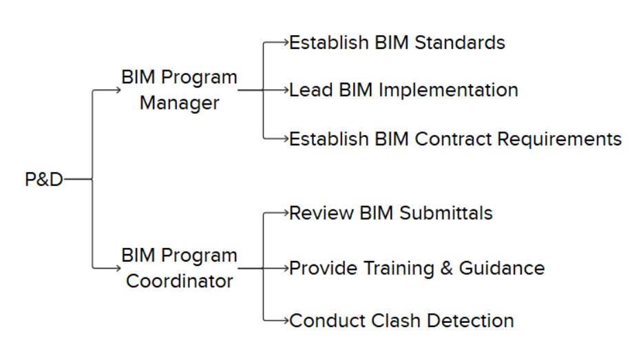

#### 2.2.2 Designers of Record 

Designers of Record must submit all project files to the VDC Department according to the Electronic Review Process Flow Chart (10.9 Project Submittal Section) and follow current BIM Standards. They are also responsible for meeting all P&D Design Standards and submitting any revised or modified P&D-stamped documents for review and acceptance. 

Roles assigned to the Designer of Record must be clearly outlined in the BIM Execution Plan (BEP). The BEP should detail the responsibilities, authorities, and qualifications of each role. These roles may include, but are not limited to:

- __BIM Project Coordinator:__ Oversee the Contractor/Consultant's BIM submittals to ensure they comply with P&D standards. Act as the main point of contact for BIM-related communication with the P&D organization. Coordinate BIM activities within the Contractor/Consultant's team. Create and maintain the Contractor/Consultant's BIM Execution Plan (BEP) to align with P&D requirements. Manage the exchange of BIM models and data with the P&D organization. Organize and lead BIM coordination meetings. Track and address BIM-related issues and conflicts. Train all team members in BIM standards and procedures. Monitor the development progress of BIM models and identify potential risks. Report on BIM performance metrics.
- __BIM Project Manager:__ Ensure that BIM models are updated, precise, and comply with established standards. Oversee the development and maintenance of BIM models by the Contractor/Consultant's team. Implement and enforce BIM standards and procedures within the team. Conduct quality control checks on BIM models. Provide technical guidance and support to the modeling team. Coordinate with other disciplines to ensure model integration. Manage the BIM model version control process. Identify and resolve modeling issues. Contribute to the development of BIM content and libraries. Stay informed about industry best practices in BIM modeling.

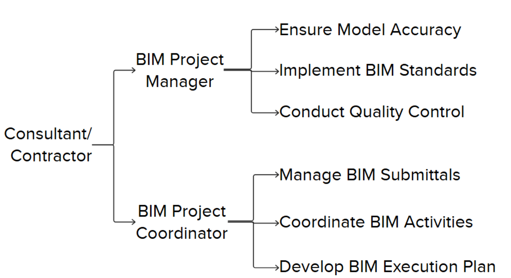

NOTE: The requirement to have unique individuals assigned to each role will depend on the Contract and specified within the project scope. For projects with no dedicated BIM staff requirement specified, the responsibilities above can be performed by the same person, and that person may also be performing other duties on the project. 

### 2.3 Applicability

BIM is mandatory for all P&D-managed projects unless expressly exempted. This standard ensures digital design and data integration across all project phases, from concept to operations. It guides consultants, contractors, and stakeholders in delivering standardized and coordinated digital models, data, and documentation.

### 2.4 BIM Objectives

P&D’s strategic objectives for BIM implementation include:

1. __Enhancing collaboration__ between design, construction, and airport operations teams through centralized, model-based coordination.
2. __Promoting interoperability__ and structured data exchange to ensure consistency across all phases and disciplines.
3. __Increasing project efficiency__ through clash detection, coordination, and cost tracking (5D).
4. __Ensuring long-term asset value__ through the delivery of clean, validated, and structured model data for seamless integration into P&D's Asset Management (AM) and facilities systems.
5. __Driving innovation__ by encouraging the use of emerging technologies such as digital twins, laser scanning, and real-time collaboration platforms (ACC).

## 2 BIM INTEGRATION

This section outlines how P&D will utilize BIM across design, construction, and asset management. 

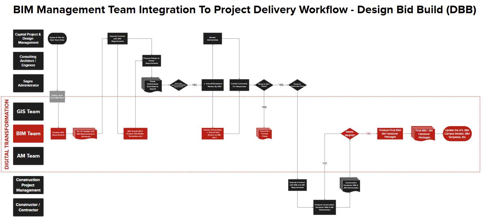

### 3.1 P&D Project Phases (DB / DBB)

Design–Bid–Build (DBB) and Design–Build (DB) are two prevalent project delivery methods in P&D construction projects.

The BIM process coordinates with both P&D project types (DB / DBB) during their key development stages, defining how digital models and data evolve progressively.

|PHASE|DESCRIPTION|
|-----|-----------|
|Schematic Design 30%|Development of schematic design documents by establishing BIM models and utilizing them to create deliverables.|
|Design Development 60%|Design development, further expanding the use of BIM models and beginning to conduct detailed coordination and clash detection between disciplines.|
|Construction Documents 90%|Model-based design deliverables with reviews for constructability, clash detection, sequencing, and bid documentation|
|Issue for Construction 100%|Models and documentation prepared for handover to contractors.|
|Final Conformed 100%|Models and documentation utilized for site logistics, estimation, 4D scheduling, submittals, and fabrication coordination|
|As-Built|As-built validation, data handover, and integration into facility management systems.|
|Operations & Maintenance|Use of BIM data for asset management, space planning, and operational efficiency.|

### 2.2 BIM Lifecycle

This graphic represents the process of creating, utilizing, and maintaining the building information. There are three major phases throughout the life of a built asset: Design, Construction, and Operations and Maintenance. All of them supported by a series of documents throughout the life cycle of a Project.

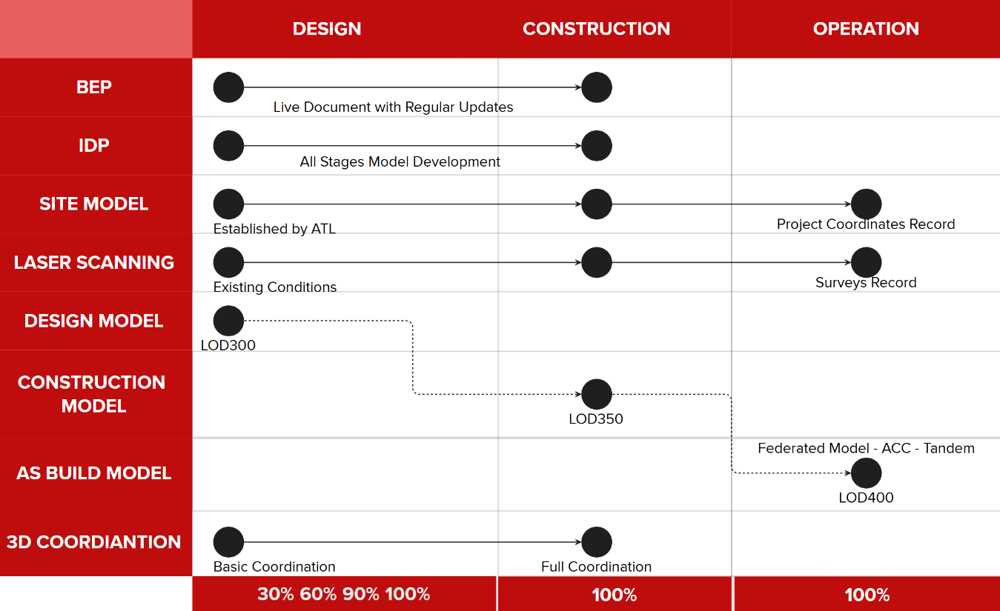 

Figure 2 - Documents and Files Lifecycle

__BEP (BIM Execution Plan):__ document that outlines how Building Information Modeling (BIM) will be implemented and managed throughout design and/or construction project. It defines the roles, responsibilities, processes, and technologies that project stakeholders will use to collaborate effectively using BIM. The BEP ensures that project goals are aligned with BIM deliverables, and that data is shared consistently across all phases — from design to construction and facility management.

__IDP (Information Delivery Plan):__ structured/tabular document that outlines what project information is needed, who is responsible for creating it, when it should be delivered, and in what format. It aligns with the project timeline and ensures that the right data is delivered to the right people at the right time to support decision-making. The IDP is an important appendix of the BIM Execution Plan and helps coordinate information flow across project stages, supporting efficient collaboration and lifecycle management.

__Site Model:__ digital 3D representation of the physical characteristics of a project’s location. It may include topography, vegetation, and other relevant site data. In BIM, the site model is used to establish coordinates for reference to other models, this model should contain the P&D coordinate system (“Airport Grid”), Levels, and other project related templates.

__Laser Scanning:__ This instrument offers comprehensive support at each stage of the renovation process, facilitating the development of current conditions and serving as a reference to ensure that the construction aligns with the as-built model.

__Design-Construction-As Built Models:__ When BIM is adopted throughout the lifecycle of a project, the design phase will produce a model that serves as a reference for the development of the construction model. Upon completion of construction, this model can then be updated with precise data to serve two purposes: first, to contribute to the federated model in the master ACC environment; second, to be utilized for maintenance purposes.

## 4 BIM DOCUMENTS AND SUPPORT FILES

We recommend reviewing all files included in the P&D BIM package to thoroughly understand the complete plan for implementation, as outlined in these BIM Standards.

### 4.1 BIM Execution Plan (BEP)

At the start of a BIM project, submit a BEP to the P&D BIM Engineer. Refer to Appendix B for BEP Template. Once approved, the BEP will serve as the comprehensive guide on BIM requirements, methodologies, and workflow for the project. 

[ATL-STD-XX-TP-GN-001](../template-docs/tp-gn-001.md)

The BEP is a "living" document, updated throughout the project lifecycle. Revisions may occur due to:

- Staff changes affecting BIM processes or deliverables.
- Process changes
- Requirement changes
- BIM Schedule changes (e.g., Coordination sign-off dates, LOD milestones)
- Any other requirement specified by  P&D.

### 4.2 Revit Templates

P&D offers Revit templates designed to ensure consistency in the development of Revit models. These templates include a variety of predefined elements, such as supporting legends, an initial view, a customized project browser, shared parameters, loaded families, view templates, and set parameters for units, fill patterns, line styles, line weights, scales, text, and dimensions, among others.

 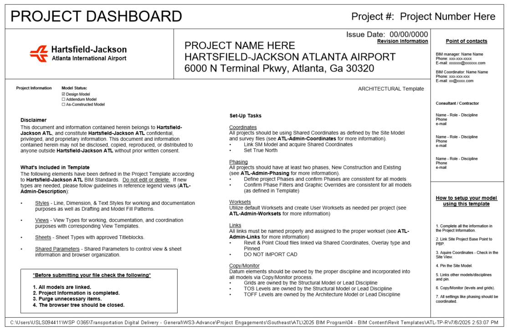

Figure 3 - Starting View from the Template

### 4.3 Revit Library

__LOADABLE FAMILIES:__

BIM Revit Templates include System Families, such as Columns, Beams, Walls, Roofs, Ceilings, Floors, among others. Users have the capability to customize this content and even create new components according to project requirements.

The Content folder comprises 2D detail components, tags, symbols, and 3D families. The library contains multi-discipline families designed to streamline the modeling process and enhance the efficiency of drawing development.

All project sheets must use the provided Title-Sheet and Contract Border from the shared content. Official P&D Title Sheets and Contract images are included. Available sizes: 22x34; 24x36; 30x42.

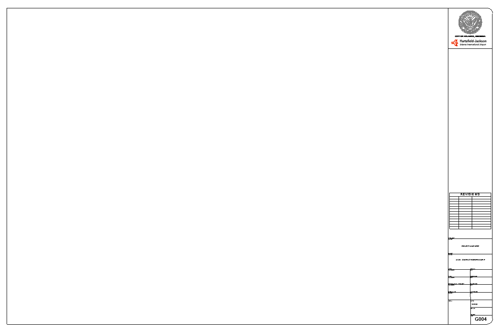!
Figure 4 - Contract Border

[A white rectangular object with black lines](../assets/images/dc-gn-002-image-08.png)
Figure 5 - Title Sheets

The location of the Title Block families within the Browser in the Revit Template.

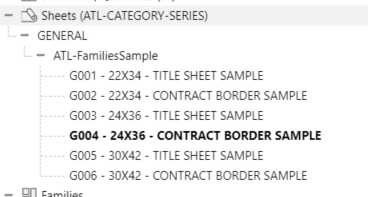

Figure 6 – Title sheets and Contract borders.

### 4.4 Creating Content

When creating Revit content, adhere to these guidelines:

• Use ATL family templates by category.

• Apply ATL-Line styles.

• Use Arial Font for annotation families.

• Ensure file sizes do not exceed 2 MB to manage project sizes and optimize performance.

• Avoid DWG files as nested components to maintain consistency and compatibility, using native Revit elements instead.

## 5 COMMON DATA ENVIROMENT

To work in a collaborative environment, P&D requires the use of a platform where the project is developed and shared with all parties participating in the project.

### 5.1 Autodesk Construction Cloud

Under the supervision of the P&D BIM Group, BIM files will be hosted on Autodesk Construction Cloud for the duration of the project. A designated project site or folder will be established within the P&D Autodesk Construction Cloud environment by the BIM Group.

All official BIM submissions shall be processed through ACC or another approved platform. All active BIM file types (.rvt, .dwg, .nwc, etc.) are to remain within the Autodesk Construction Cloud environment.

### 5.2 Folder Structure  

The P&D BIM Standard structures project deliverables for better coordination within P&D and their Consultants. The goal is to enhance collaboration and ensure electronic information can be used beyond the initial contract.

Specific folder structures are not prescribed; however the delivery team should be able to provide model and file workflows that enable information to be classified into the following areas:

| Folder | Purpose |
|--------|---------|
| WIP | Internal workspaces for each discipline/team. Only accessible by authoring team. |
| Shared | Contains information models/data that have been checked and approved for cross-discipline coordination. |
| Published | Final deliverables for construction or handover (e.g., IFC drawings, certified models). |
| Archive | Secure and immutable records of each project phase or milestone by date. |

## 6 SOFTWARE 

The P&D BIM practice utilizes several Autodesk products. The BIM Standards employ terminology and references specific to Autodesk-based software applications.

All active project files must be developed in accordance with the current software version used by P&D, including all third-party applications, regardless of the project's start date.

Due to the backwards compatibility issues of certain applications, please ensure to verify the version currently in use by P&D.

The current version utilized for all Autodesk products is 2026.

| CATEGORY | SOFTWARES |
|----------|------------|
| Data Authoring | Autodesk Revit Autodesk Civil 3D Autodesk AutoCAD |
| Data Exchange | Autodesk Construction Cloud |
| Data Analysis | Autodesk Navisworks Manage Primavera P6 |
| Data Visualization | Microsoft Power BI |
| Asset Information Management | Autodesk Tandem Cityworks |

### 6.1 Files Ownership

P&D retains ownership of the BIM Model, including all inventions, ideas, designs, and methods it contains. This encompasses Revit families (both system-based and component-based), and any other content submitted as part of the BIM Model itself. 

External parties, such as consultants and contractors, are permitted temporary use of the BIM Model for the duration of the project. Upon completion of the project, they are required to return all copies of the BIM Model to P&D.

## 7 COORDINATE SYSTEMS 

The coordinate system is delineated by a basemap with the “Airport Grid” custom coordinates referred to as ATL02. Please adhere to the ["Revit Project Setup"](../standards/dc-gn-003.md) document, utilizing our template and the Concourse file in Revit to acquire these coordinates for your project. To verify their accuracy, export a 3D model and import it into the Civil 3D basemap to confirm the location.

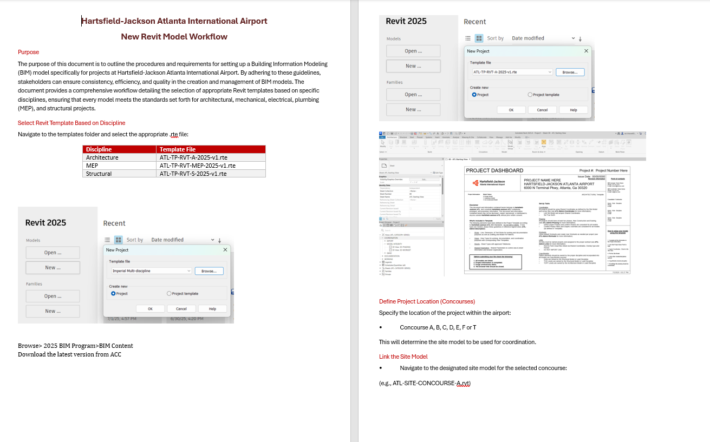

Figure 8 - [Revit Project Setup with Custom Coordinates Document](../standards/dc-gn-003.md)

## 8 INFORMATION DELIVERY PLAN (IDP)

The Information Delivery Plan (IDP) outlines the required details for each submittal at various project stages. These include:

- Level Of Development (LOD) definitions
- Model Element Table with LOD and Level of Information (LOI)
- Project information (data specification)
- Project parameters (data specification)
- Asset information requirements

### 8.1 Level of Development (LOD) 

This section outlines the concept of Level of Development (LOD) within the industry, emphasizing its importance in defining the amount and degree of building information, both graphically and non-graphically. It highlights the cumulative nature of LOD progression throughout project stages and references the BIM Forum LOD Specification as a key resource. Furthermore, it clarifies P&D's specific requirements for LOD adherence and the distinction between Design and Construction Models.

The definitions for LOD are based on the expanded AIA levels by BIMForum ([more information on bimforum.org](https://bimforum.org/resource/lod-level-of-development-lod-specification/)). The Level of Development (LOD) is a crucial concept in Building Information Modeling (BIM) that defines the extent and reliability of information contained within a BIM model at various stages of a project. It encompasses both the geometric detail (Level of Detail) and the associated data and attributes (Level of Information) of building elements.

A common equation used to represent the composition of LOD is:

__Level of Development = Level of Detail + Level of Information__

Level of Detail (LOD): Refers to the geometric complexity and visual representation of building elements within the model. It dictates how accurately and comprehensively an element is depicted visually. The LOD is cumulative and should progress along with the design from stage to stage.

Level of Information (LOI): Encompasses the non-graphical data associated with building elements, such as material properties, performance characteristics, manufacturer details, and other relevant attributes.

P&D requires, at a minimum, that models adhere to the latest version of the BIM Forum LOD Specification (Part I), publicly available at [https://bimforum.org/resource/lod-level-of-development-lod-specification/](https://bimforum.org/resource/lod-level-of-development-lod-specification/).

To further refine LOD requirements and tailor them to specific project needs, P&D utilizes a project-specific Information Delivery Plan (IDP) spreadsheet. This document complements the BIM Forum LOD Specification by providing a detailed breakdown of LOD assignments for each building element and specifying the information parameters required at each project stage.

The IDP serves as a roadmap for BIM development, guiding the modeling team in creating models that meet the project's unique information requirements. It ensures that the right information is available at the right time, facilitating informed decision-making and efficient project execution.

### 8.2 Design Model vs. Construction Model

P&D recognizes a distinction between Design Models and Construction Models, acknowledging that the latter requires a higher LOD to accurately represent how a project will be built on-site.

Design Model: Primarily focuses on the architectural and engineering design aspects of the project, providing a comprehensive representation of the building's form, function, and systems.

Construction Model: Builds upon the Design Model by incorporating detailed information about construction methods, materials, and sequencing. The Construction Model is developed to a higher LOD than the Design Model to support construction planning, coordination, and execution. It enables contractors to identify potential clashes, optimize material procurement, and streamline the construction process.

### 8.3 Parameters

Project parameters required for each modelled element by stage are established in the Information Delivery Plan. Certain parameters apply to all assets, while others are specific to asset types. For additional details, please refer to the document: ATL-TP-EXC-IDP.xlsx.

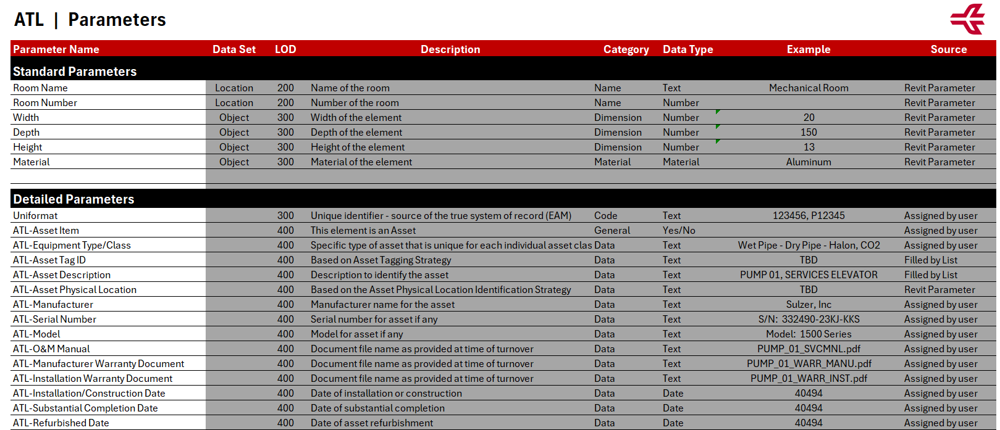

### 8.4 3D Model Exclusions

Typically, objects less than one inch in size are not included in the modeling process during the Design and Construction phases. 

The following objects are optional in the BIM models and may be included at the designer’s discretion:

|System|Details|
|------|-------|
|Electrical Systems|Conduits under 1": not modeled in 3D, Supports, hangers: listed but typically simplified, Wiring: generally schematic only|
|Mechanical Systems|Hangers, supports, vibration isolators: usually omitted, Duct/pipe insulation: modeled only for key spatial cases|
|Plumbing Systems|Pipes under 1" (drains/vents): may be excluded, Pipe insulation, Cleanouts/minor accessories: often omitted|
|Fire Protection|Piping under 1": excluded, System valves/small accessories: omitted, Pipe hangers/seismic bracing: not modeled|

## 9 PROJECT COORDIANTION MEETINGS

To ensure consistent alignment across all design and construction disciplines, the following meetings may be mandated throughout the project lifecycle. The requirements for BIM coordination meetings will be specified within the individual project scope.

### 9.1 Design Kickoff Meeting

__Purpose:__ Establish overarching project goals, delineate team responsibilities, set schedule milestones, and clarify design intent among all disciplines.

__Attendees:__ Discipline leads, client representatives, BIM Managers, and Project Managers.

__Deliverables:__

- Comprehensive design schedule with key milestones
- Communication matrix
- Defined project file structure and naming conventions
- Summary of constraints and digital modeling requirements

### 9.2 BIM Kickoff Meeting

__Purpose:__ Define BIM-specific workflows, establish coordination strategies, outline modeling expectations, and address software interoperability and data exchange standards.

__Attendees:__ BIM Leads, BIM Manager, Discipline Coordinators, VDC personnel.

__Deliverables:__

- BIM Execution Plan (BEP)
- Coordination schedule and specified software environments
- ACC folder structures with defined permission protocols
- Shared parameters and standardized project templates
- Linking strategies and version control guidelines

### 9.3 Biweekly Coordination Meetings

__Purpose:__ Monitor model progression, identify and resolve coordination issues, and align teams toward shared project milestones.

__Frequency:__ Biweekly (or weekly during critical phases)

__Agenda:__

- Evaluation of recent ACC model uploads
- Review of open and overdue Model Coordination issues
- Walk-through of coordination topics by trade
- Schedule status check and upcoming milestone planning

__Tools:__

- ACC Model Coordination module
- Issues module (organized by trade and location)
- ACC Meetings module (for minutes and action items)

### 9.4 Clash Detection Meetings

__Purpose:__ Collaborative review of detected clashes—automated or manual—within project models.

__Frequency:__ As required, dictated by project phase and model update intervals

__Workflow:__

- Utilize ACC Model Coordination module for initial clash identification
- Assign issues to respective trade leads with clearly defined responsibilities and deadlines
- Monitor progress via "Assigned to Me" and "Due Soon" filters in ACC

__Outcome:__

Resolution of all high-priority clashes prior to freeze deadlines or permit submissions.

### 9.5 Review / Handoff Meetings

__Purpose:__ Conduct formal evaluations of project phase deliverables, including Design Development, 50% CD, 100% CD, and Construction Handoff.

__Attendes:__ Discipline leads, QA/QC personnel, BIM/VDC staff

__Deliverables:__

- Reviewed and annotated deliverables set
- Exported summary report of clash resolutions
- Confirmed integration plan for as-built models where applicable

### 9.6 Use of ACC for Meeting Follow-up

All meeting documentation—including agendas, attendance records, and action items—must be uploaded to the ACC Meetings Module within 24 hours post-meeting.

Issue tracking, clash resolution, and version control processes are to be managed exclusively within designated ACC tools:

- __Model Coordination:__ For clash detection, issue tracking, and spatial filtering
- __Issues:__ To manage task assignments, comments, approvals, and records
- __Docs:__ For version management, drawing/model reviews, and submittal documentation
- __Insights:__ To monitor dashboards reflecting issue resolution rates and overall coordination health

## 10 DESIGN MODEL REQUIREMENTS

This section outlines the requirements, processes, and procedures currently mandated and utilized by P&D concerning the use of Building Information Modeling (BIM) during the design phase. This includes projects under Stages I to III for the traditional Design-Bid-Build project delivery method. For Design-Build projects, this section should be considered in conjunction with Construction, and any specific processes should be detailed in the BIM Execution Plan (BEP).

### 10.1 Goals and Uses

The primary goal of the Design Model is to facilitate design coordination and the generation of Construction Documents. As an owner, P&D views the Design Model as an essential tool to support:

- 2D Documentation linked to the 3D model.
- 3D BIM Coordination among all disciplines.

### 10.2 Site Model (SM) 

The P&D BIM team provides the Site Model (SM) file during the Project's BIM Kick-off meeting. The SM includes a CAD background contains the project coordinate system for location, rotation, and elevation. All discipline models should link to the SM to obtain project coordinates. This file is intended for reference only and must not be altered. The Grids and levels are included in this file. Upon receiving the SM, the Consultant should evaluate if any information requires further validation. The SM can be utilized to begin early design options and project planning at risk, but consultants/contractors are required to obtain their own survey of project areas and verify the information included in the SM before detailed design.

Goals for the site model include providing a comprehensive, accurate representation of the project area that can be used for planning, design, and construction activities. It aims to facilitate communication and collaboration among all stakeholders, ensuring that all disciplines have access to up-to-date and reliable data. The model can also support decision-making processes by offering detailed insights into site conditions, constraints, and opportunities. 

Once projects are completed consultants/contractors should provide an updated set of models as part of the final deliverables. Those models will provide P&D with an improved starting set of information for the next project. 

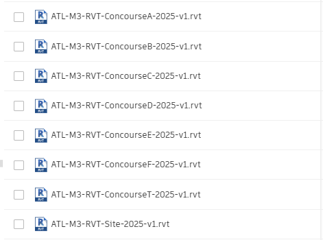

Figure 9 - The Projects Concourse enables you to initiate your site configuration.

### 10.3 Discipline Models

The design model made in Revit, is a 3D representation of each discipline in a project. Task leaders follow P&D-BIM Standards to create and update these models. Design models should link to other discipline models to improve coordination and convey the design intent accurately.

#### 10.3.1 Design Model Creation Workflow 

Each discipline uses P&D Revit Templates to develop its design model. After creating the model, acquire project coordinates from the Site Model. The Architectural file defines main levels, and the Structural file sets primary grids. Other disciplines use Revit's 'copy/monitor' function to replicate these elements. Once done, link all project models for coordination and alignment.

### 10.4 Working with Links

#### 10.4.1 Linking Revit Files

All project Revit files are required to be linked together, including the Site Model.

Linked models should be pinned to maintain their coordinates relative to the active model and other linked models.

#### 10.4.2 Linking AutoCAD Files 

Some AutoCAD drawings, called Reference Drawings, may need to be linked into Revit for underlying purposes:

- Ensure linked files have no external references.
- Set the line-weight in 'Layer Properties Manager' to 'Default'.
- Avoid importing unnecessary data such as hatching or construction lines.
- Clean up DWG files by deleting unnecessary parts and layers before importing.
- Minimize the number of linked/imported DWG files, link only essential files.
- Pin all linked AutoCAD files.
- Do not explode imported geometry as it can create excessive elements.

__NOTE:__ It is recommended to use the Link CAD Tool rather than the Import CAD Tool to prevent performance issues with AutoCAD entities. Reference Drawings are linked into Floor Plan Views and/or Ceiling Plan Views. 

### 10.5 Shared Parameters

Revit-based applications support the creation of custom fields that can be shared between project and family files, allowing them to be scheduled and called out correctly. This functionality is known as "Shared Parameters." A list of Shared Parameters, which includes those needed for schedules, has been provided by P&D and can be expanded as required.

Figure 10 - Shared Parameter File

Refer to the Information Delivery Plan spreadsheet for common and detailed parameters.

### 10.6 Revit Templates

Each Project Template includes a Legend View that displays key Project Information upon opening the project. This default starting View is also used for synchronizing with the Central model.

Figure 11 - Example of Starting View

Within the view you will find basic information and different references to other Legends that will provide guidance on important aspects related to the use of Revit. These Legends include detailed instructions and best practices for managing various elements within the project, ensuring that your workflow remains efficient and that the project adheres to the necessary standards and protocols.

#### 10.6.1 Project Information 

The project information needs to be completed at the start of the project.

[A screenshot of a computer](../assets/images/dc-gn-002-image-16.png)

Figure 12 - Project Information

#### 10.6.2 Project Browser

The Customized Revit Project Browser has been integrated within various Discipline Templates. Within the Project Browser, Views and Sheets will be organized according to the ATL-View Classification as outlined below:

|TYPE|DESCRIPTION|
|----|-----------|
|COORDINATION|These views ensure coordination across various Discipline Revit Models and are intended solely for coordination purposes. They encompass Floor Plans, Ceiling Plans, 3D Views, and Elevations. The subcategories include EXPORT, MODEL INTEGRITY, and QAQC. These views must not be deleted.|
|DOCUMENTATION|The views are intended to be incorporated into the contract set.|
|WORKING|These views are provided solely for working purposes and are not intended for inclusion in the Contract Set. They are temporary and should be removed prior to the final submission.|

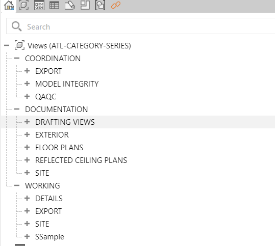

Figure 13 - General Project Browser

The Project Browser scheme should be set to “ATL–CATEGORYSERIES.” Do not modify the Filter settings of this scheme. Although it is permissible to add other browser schemes temporarily, ensure that the scheme is reverted to “ATL–CATEGORYSERIES” before the submission preparation process. Each view must be associated with its corresponding category by assigning the appropriate View Template. Once assigned, the associated category will be displayed in the corresponding parameters under Identity Data.

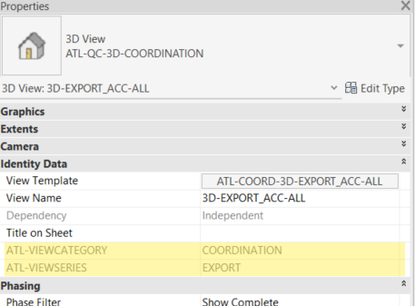

Figure 14 - Highlighted ATL-VIEW CATEGORY and ATL-VIEWSERIES parameters.

#### 10.6.3 Text Styles 

Templates have several text styles options defined in the Text Style Legend:

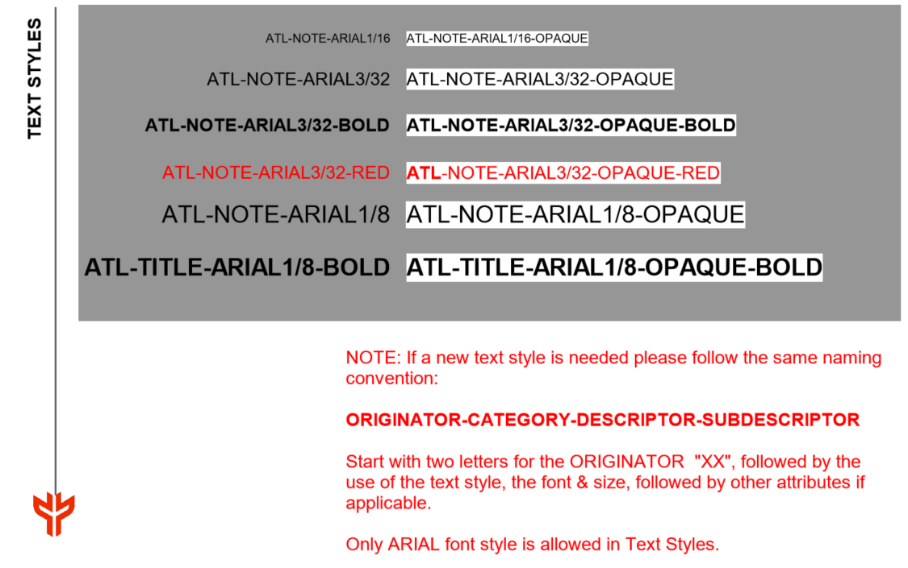

Figure 15 - Text Style Legend in ATL-Template

- New line styles must follow the naming convention: “ORIGINATOR-CATEGORY-DESCRIPTOR-SUBDESCRIPTOR.” Start with "XX" for the ORIGINATOR, followed by dimension style, rounding, and other attributes if needed.
- Only ARIAL font style is allowed in Dimension Styles.

 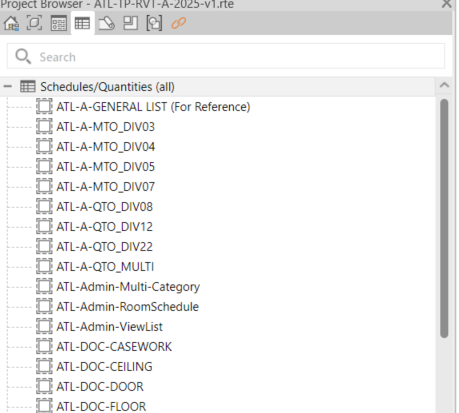

Figure 16 - Text Style and the rest of Drafting Standards Legends in Project Browser

#### 10.6.4 Line Weights

Line weights are provided for Model, Annotation, and Perspective Objects. Sixteen line-weights are available for these objects and are defined at a 1/8” = 1’ scale.

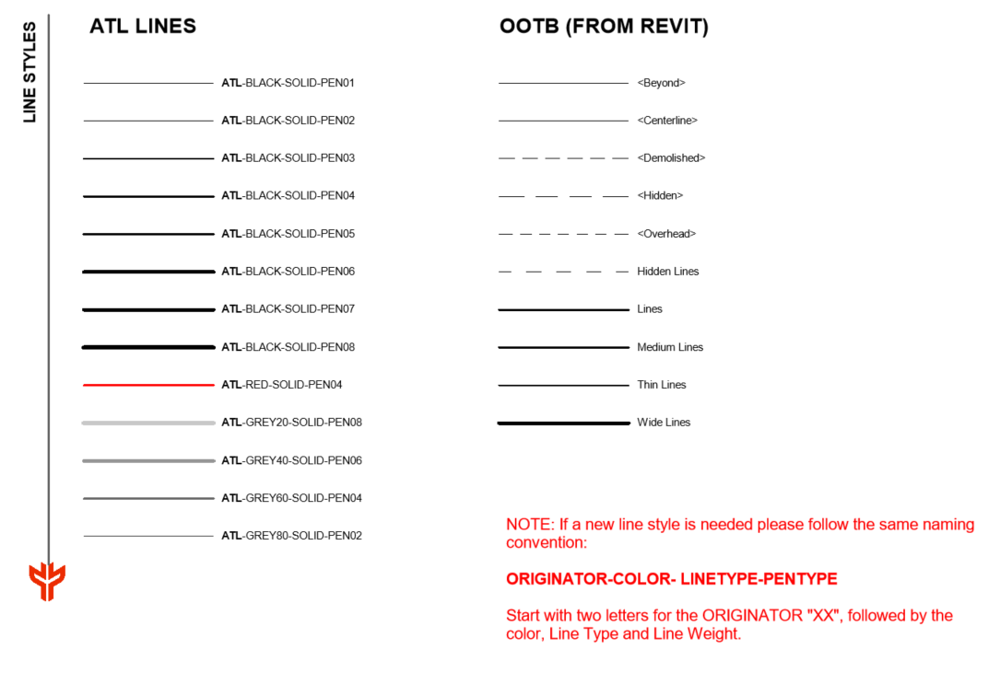

Figure 17 - Line Style Legend in ATL-Template

#### 10.6.5 Symbols

Different annotations, such as tags, callouts, north arrows, graphic scales, view titles, among others, have been pre-loaded within the templates based on the discipline.

__Note:__ The annotation symbols are loaded under the Project Browser within the Families tab under Annotation Symbols. If a new symbol is required, it must adhere to the following naming convention:

“ORIGINATOR-SYM-DESCRIPTION1-DESCRIPTION2”

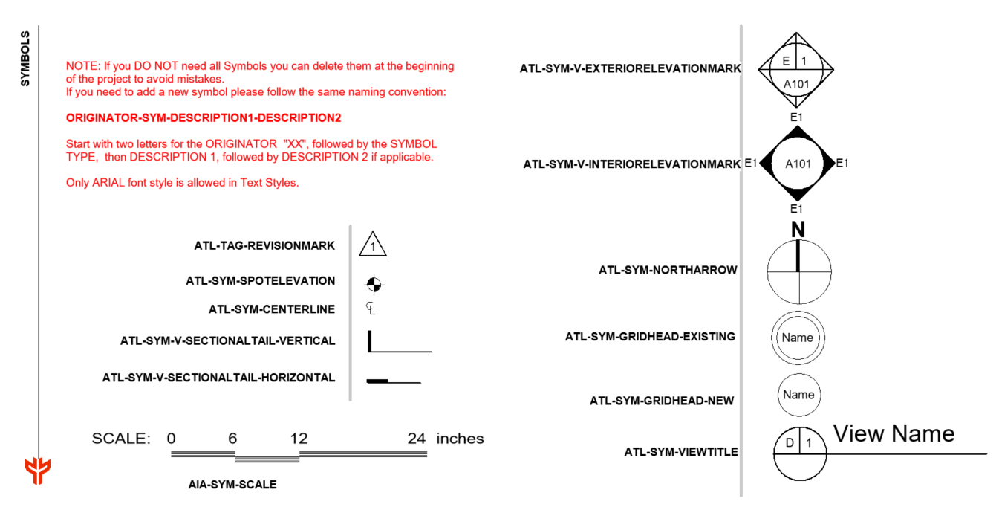

Figure 18 - Symbol Legend Library in ATL-Template

#### 10.6.6 Filled Regions 

The following fill regions have been provided: 

- Opaque and Transparent
- Drafting Filled Pattern and Model Filled Pattern (2D and 3D)

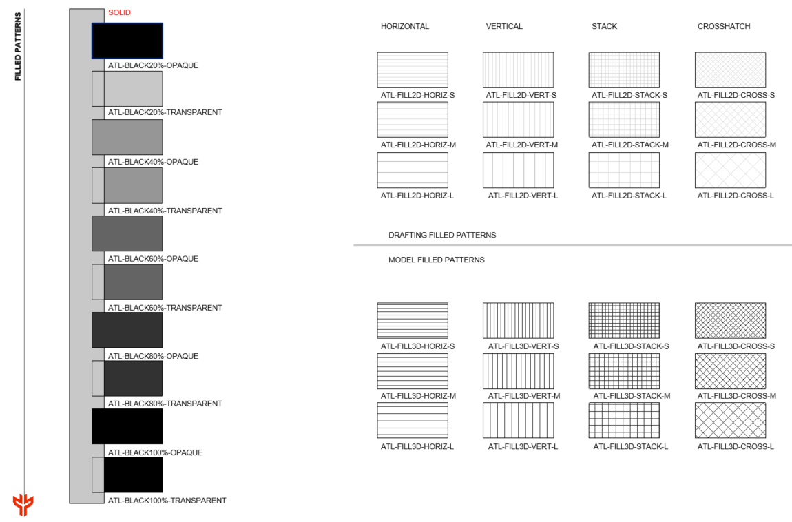

Figure 19 - Filled Region Legend in ATL-Template (small sample shown)

#### 10.6.7 Schedules 

Engineering Estimates Schedules are in the Discipline Templates and categorized as:

- __ATL-DOC schedules__: Support documentation and provide individual information.
- __ATL-QTO and ATL-MTO schedules__: Assist the estimating process.

A general list schedule is included for reference. 

__Note__: Duplicate schedules in Revit using Filter and Sorting/Grouping Categories. Do not delete or modify the "Admin" schedules created for QC: "ATL-Admin-Multi-Category" and "ATL-Admin-ViewList".

Figure 20 - Schedules in the templates.

#### 10.6.8 Phases of the Project

Phases should match the Project Construction Phases, as determined by the Lead Discipline. The image shows phase settings for Existing, Demolished, New, and Temporary. Do not alter Phase Filters and Graphic Overrides.

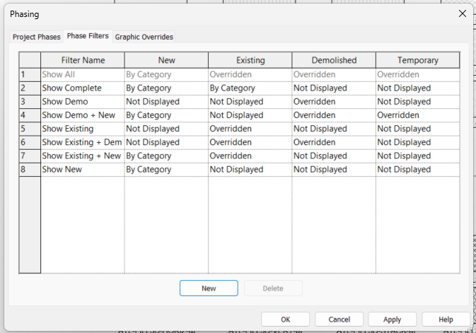

Figure 21 - Phase Filter Settings

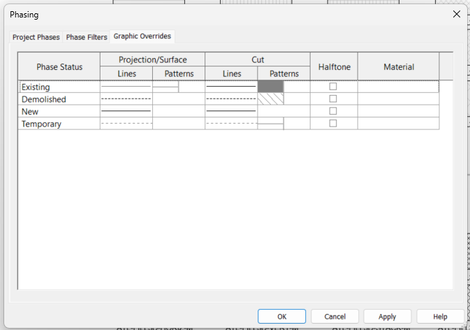

Figure 22 - Phase Graphic Overrides Settings

#### 10.6.9 Rooms

Rooms are important Revit elements that should be created within the Architecture model. These elements are defined by other components in the model, such as walls and ceilings. It is necessary that all rooms have enclosed spaces. Within the project, room properties, including room number and room name, must be accurately populated. Completing this information is essential for subsequent steps, such as model analysis and quantity takeoff. Room computation has been enabled to account for both area and volume, and it has been set at wall finish, as illustrated in the image below.

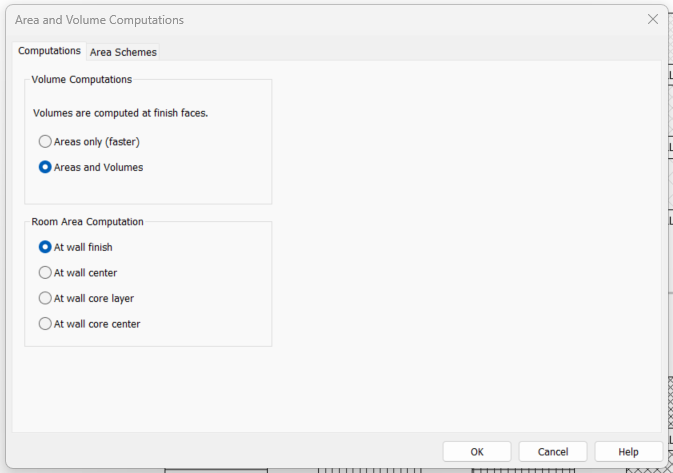

Figure 23 - Area and Volume Computation

#### 10.6.10 View Templates

View Templates in Revit are predefined sets of rules and settings applied to views within a model. They ensure consistency, save time, and maintain standards throughout the project. This method streamlines tasks such as documentation, coordination, and visualization by automating and standardizing view settings, including:

- __Visibility/Graphics Overrides__: Manage elements' visibility and appearance (e.g., line weights, patterns, and colors)
- __View Display Settings__: Define settings like detail level, scale, and display styles.
- __Filters and Overrides__: Apply specific filters to emphasize or conceal elements.
- __Discipline-Specific Customization__: Customize views for architecture, structure, or MEP purposes.

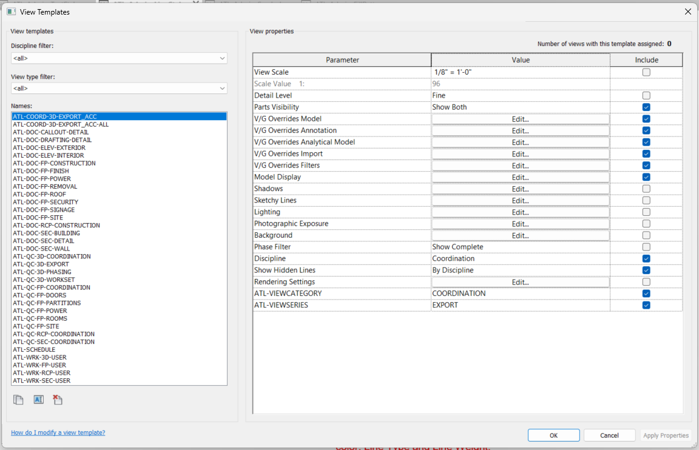

Figure 24 - View Templates List

#### 10.6.11 Quantity Takeoff 

The Quantity Take-off (QTO) process facilitates the estimation of material quantities and project costs directly from BIM models. By utilizing parametric data embedded within model elements, QTO enables project teams to extract, categorize, and quantify components accurately, ensuring alignment with project requirements and enhancing cost management throughout the project lifecycle. The P&D Templates has integrated QTO schedules by Spec Divisions to obtain material and quantity information directly from models. These schedules are identified as “ATL-QTO” and “ATL-MTO.”

The Design team must assign the correct P&D Spec Number to each 3D model element so that these elements are included in the QTO schedules and automatic QTO calculations are generated. To accomplish this, verify that the “UniformatClassification.txt” file is loaded in Revit by navigating to Manage > Additional Setting > Assembly Code.

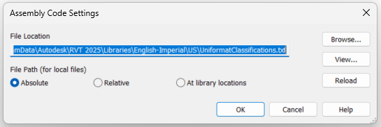

### 10.7 BIM Coordination Model 

The ATL BIM Manager coordinates and integrates processes into the BIM execution plan for projects with external consultants. The BIM Coordinator handles clash detection, creating a Clash Report one month before 100% submissions using Model Coordination withing ACC or Autodesk Navisworks. Task Leaders must generate Navisworks files (.nwc) from their Revit Models. After testing clashes, the BIM Coordinator shares the Clash Report with the P&D BIM Manager.

#### 10.7.1 Inter-discipline Color Scheme

The following color scheme is implemented to ensure consistency and facilitate easy identification for all users during project coordination and the generation of Clash Reports.

|DISCIPLINE|COLOR|
|----------|-----|
|Architectural|Cyan|
|Normal Power|Royal Blue|
|Miscellaneous Communication|Brown|
|Fire Alarm|Red|
|Telephone / Computer|Black|
|Life Safety|Yellow|
|Vertical Circulation|Orange|
|HVAC|Green|
|Plumbing|Magenta|
|Fire Protection|Red|
|Structural|Grey|

__Note:__ Based on project requirements, further breakdowns can be established either by level or by system.

#### 10.7.2 Interference Check / Clash Detection

The use of Clash Detection tools within our BIM practice can result in three outcomes:

- __No Clash:__ This indicates the absence of any clashes, which is the ideal scenario.__ __
- __Soft Clash:__ This alerts to an excessive proximity between two objects that may cause issues during execution, installation, or maintenance. During the design phase, this type of clash does not require additional action. Example: Ducts passing through partition walls.
- __Hard Clash:__ This detects a physical collision between two model objects, necessitating action from the team. Example: Columns intersecting with equipment.

__NOTE:__ The Clash Detection tool should be used during the design process to coordinate major building elements and systems, facilitating the early identification of interferences.

#### 10.7.3 Single-Discipline Clash Detection

Each Discipline’s Leader will perform single-discipline clash detection using the Interference Check tool in Revit or Clash Detective in Navisworks.

#### 10.7.4 Cross-Discipline Clash Detection

The BIM Coordinator will conduct cross-disciplinary clash detection sessions as required by the project, usually defined in the BEP (BIM Execution Plan). Design Projects require at least two sessions: one a month before the 50% progress submission and one a month before the final 100% submission. The BIM Coordinator will use Autodesk Navisworks or ACC for these sessions. Each Discipline Leader is responsible for creating a Navisworks file from their Revit Models (.nwc) or preparing the ACC views for coordination.

#### 10.7.5 Navisworks Clash Report

The BIM Manager Engineer compiles all discipline-specific Navisworks Cache files (.nwc) into a single Master Navisworks file (.nwf). A Navisworks Template is used for coordination purposes. After each clash detection session, a Federated Model (.nwd) file with saved viewpoints of all new or existing clashes will be distributed to all Discipline Leaders. The BIM Coordinator will also create a report listing analyzed clashes, issues, and agreed actions. Following the BIM Kick-off Meeting, the BIM Coordinator will provide a 3D Coordination Meeting Report template, which includes:

- Introduction
- List of Models Reviewed
- Overview of Clash Report
- Clash Detection Results

## 11 DELIVERABLES

Electronic deliverables should be provided at the completion of every project. All submitted sheets need to use P&D Title Sheets and Contract Borders as specified in this Manual. Additionally, all submitted electronic files must be compatible with the current version of Autodesk Revit software used by P&D and must follow the latest version of P&D BIM Standard as outlined in this Manual.

For each milestone established in the BEP, a submission is required. The drawing set must be plotted in PDF format accompanied by their corresponding DWG file. The PDFs should be compiled as multi-sheet documents.

Depending on the project software used, the following formats are required in every submission: 

- RVT: Autodesk Revit files 
- NWD: Autodesk Navisworks Document files 
- NWF: Autodesk Navisworks Federated files 
- NWC: Autodesk Navisworks Cache files 
- PDF: Adobe 2D Portable Document Format files
- DWG: AutoCAD and Civil3D files

All project submittals must be submitted and reviewed electronically, following P&D’s approved Electronic Design Review Process Flow Chart (Attachment 1). This paperless online system replaces hard copy submissions. 

Each submittal must include the source electronic data, BIM models, and drawing files, as well as all electronic files and data referenced or used in preparing those files. This requirement covers CAD and Revit files (DWG and RVT) along with PDFs, images, point clouds, Excel/CSV files, databases, and any other material needed to reproduce the plans and specifications from the original files.

Electronic files and source data are to be submitted through Autodesk Construction Cloud. Project teams will receive access to Autodesk Construction Cloud at the project’s outset or by submitting a request to the P&D BIM Program Team.

Reviews can be conducted at the reviewer’s desktop or in the P&D Review Room. External reviewers can also work remotely. To access the system, visit http://www.sagesgov.com/atlnext-ga. External users need to register on the website; internal users should contact the Review Coordinator for account setup.

The P&D Review Coordinator oversees the process under the supervision of the Directors of Architecture and Engineering.

### 11.1 Project Submittals

Design review submittals are to be prepared and provided for the following review phases unless specified otherwise in the contract:

- Schematic Design (30%)
- Design Development (60%)
- Construction Documents (90%)
- Issue for Construction (100%)/Issue for Bid/Pricing: Drawings sealed by a State of Georgia Architect/Engineer of Record are not required for this submittal.

|PHASE|PERCERNTAGE|REVIEW|SUBMISSION|
|-----|-----------|------|----------|
|Schematic Design|30%|Naming Convention|Appropriate Templates, Coordinate system, Model breakdown, Levels and Grids|ACC|
|Design Development|60%| + LOD, Shared Parameters, Phases Setup|ACC|
|Construction Documents|90%| +Room / Doors Naming, + Asset Data, + Coordinated model|ACC|
|Issue for Construction|100%| +Set of Drawings, + Design Asset Data|ACC, Hard Copy|
|As-Built|Final| +Construction Asset Data|ACC, and as below|

Exact handover requirements can vary from project to project but as a rule this is the minimum requirement expected from final submittals:

- Issue for Construction (Final Conformed/Permitting): 	__Drawings sealed by a State of Georgia Architect/Engineer of Record are required for this submittal.__

1. Six (6) full-size sets of plans and specifications are needed for P&D/AFD stamp acceptance.
2. Submit all final plans, specifications, and related electronic files (including CAD, Revit, PDFs, images, point clouds, Excel/CSV, and databases) via upload to Autodesk Construction Cloud. Include any data needed to reproduce the plans and specifications from source files.
3. P&D’s Review Coordinator will coordinate the review and stamp acceptance of the plans by the P&D’s Director of Architecture/Engineering and AFD.
4. P&D’s Review Coordinator will coordinate the preparation of the Request for Permit letter by P&D’s Director of Architecture/Engineering. 

### 11.2 ACC Model Transmittal Process

This section delineates the standardized protocol for transmitting Revit models as part of formal submissions to stakeholders at Hartsfield-Jackson Atlanta International Airport (ATL). The step-by-step procedure outlined below is designed to ensure data integrity, clear coordination, and comprehensive audit traceability throughout the model delivery process.

This process must be carried out in a controlled way to guarantee that all deliverables comply with P&D BIM Standards, project phase requirements, and key coordination milestones.

#### 11.2.1 Transmittal Workflow 

__Step 1: Internal QA/QC Review: __Prior to initiating a transmittal, the model must undergo an internal Quality Assurance/Quality Control review.

- Verify compliance with P&D’s Information Delivery Plan (IDP), model validation rules (including clash detection, appropriate phase usage, adherence to naming conventions, and proper workset organization).
- Conduct comprehensive Revit model audits (audit file, purge unused elements, compact files as necessary).
- Execute Autodesk Revit Health Checks (evaluate model performance, address warnings, and resolve corruption issues).

__Step 2: Model Export Preparation__

- Confirm that all external links (Revit, CAD, IFC) utilize relative paths and are included in the export package.
- For projects using linked models, verify correct application of Shared Coordinates.
- Remove views, sheets, or elements not pertinent to the specific transmittal.
- Configure a 3D view titled “ACC Transmittal\_View \[Date\]” to illustrate the required scope.
- Save the model as a detached copy from Central with “Preserve Worksets” enabled.

__Step 3: Model Packaging Using eTransmit__: Employ Revit’s eTransmit tool to generate a clean, portable model package. eTransmit will produce a zipped folder containing the model and all references, which should be uploaded as the official transmittal package.

Within the eTransmit dialog, ensure the following options are selected:

- Include Revit links.
- Include supporting files (such as CAD links and DWF markups, if applicable).
- Remove unused families and purge, provided this aligns with QA/QC recommendations.
- Upgrade the model to the current version, if necessary.

__Step 4: Submission via ACC Transmittal Workflow:__ Upload the finalized ZIP package to the designated Autodesk Construction Cloud (ACC) folder specified in the BEP (Section 11).

Initiate a formal transmittal in ACC using the "Transmittals" module:

- Add relevant recipients (including P&D reviewers and consultants).
- Apply consistent naming conventions: \[Transmittal *Milestone*\]\_\[Date\].
- Provide a summary of contents and the intended purpose of the model.
- Attach the zipped eTransmit package.
- Dispatch the transmittal and record the ACC transmittal ID for project documentation.

The ACC platform will automatically log the submission’s date, time, and recipient details.

__Submission Timing:__ Revit model transmittals must follow project schedule milestones and BEP submission dates. Submissions outside these deadlines require written approval from P&D BIM Management.

## 12 CONSTRUCTION MODEL REQUIREMENTS

The design model made in Revit, is a 3D representation of each discipline in a project. Task leaders follow ATL-BIM Standards to create and update these models. Design models should link to other discipline models to improve coordination and convey the design intent accurately.

### 12.1 Goals and Uses

The Construction Model is of top importance to the P&D as 

Uses of the Construction Model:

- Clash detection and coordination.
- Construction sequencing (4D)
- Quantity take-off (5D)
- Field layout and installation
- RFIs and submittals
- Fabrication and shop drawings
- As-built documentation

### 12.2 Construction Models Creation Workflow 

Each discipline uses P&D Revit Templates to develop its design model. After creating the model, acquire project coordinates from the Site Model. The Architectural file defines main levels, and the Structural file sets primary grids. Other disciplines use Revit's 'copy/monitor' function to replicate these elements. Once done, link all project models for coordination and alignment.

#### 12.2.1 Coordination and Clash Detection

All models should be submitted on a weekly basis for coordination review. Utilize Navisworks or other approved tools for clash detection purposes. Ensure that any identified clashes are resolved prior to model approval for construction. Maintain and share coordination logs within the Common Data Environment (CDE).

#### 12.2.2 Quality Control

Before submission, ensure models meet the following:

- Compliance with standards
- Clash-free status.
- Metadata completeness
- Correct file naming
- Sheet views and schedules (if applicable)

### 12.3 Level of Development (LOD)

All models must adhere to the Level of Development (LOD) definitions as specified by the BIMForum LOD Specification or as outlined in the project's BIM Execution Plan (BEP). The following LODs are required during the construction phase:

|Discipline|Construction Start|As-Built|
|----------|------------------|--------|
|Architectural|LOD 350LOD 400|
|Structural|LOD 350|LOD 400|
|MEP|LOD 350|LOD 400|
|Civil|LOD 300|LOD 350|

#### 12.3.1 Geometry

All geometries must be precise and match real-world dimensions. Penetrations, clearances, and interfaces between trades must be accurately represented. The construction model should not include any placeholders or 2D-only components.

#### 12.3.2 Metadata

Each model element should include the following data fields (if applicable):

- Element ID / GUID
- Description
- Discipline
- System name
- Material
- Manufacturer
- Model number
- Installation date (for final handover)
- Maintenance data (optional but encouraged)

## 13 AS-CONSTRUCTED MODEL

The As-Constructed Model is the final version of the Construction Model, submitted to P&D for final approval during project handover. This model reflects the as-built conditions and must include the required Level of Detail (LOD), be validated through Laser Scanning, and contain the relevant Asset Data within each modeled element.

At project closeout, as-built models must:

- Reflect field-verified conditions.
- Include installation dates.
- Exclude temporary construction geometry.
- Be delivered in RVT. 
- Include ASSET data. 

### 13.2 Goals and Uses

The As-Constructed Model is of paramount importance to P&D as both the owner and operator of its facilities. It ensures the delivery of reliable and accurate information regarding the completed Work. The As-Constructed Model will serve the following purposes:

- Serving as a design reference for future expansions or renovations made to the facility.
- Providing asset information that the Authority can export to the Facility Management software in use.

### 13.2 Real World Representation

This manual considers two types of actual or “real-world” conditions:

- __Existing conditions:__ These encompass all material objects or elements with which the Contractor must work around to execute the Work. Existing conditions may or may not remain at the end of the project (e.g., due to demolition or decommissioning activities). The Project Model Specification outlines the requirements for modeling existing conditions.
- __As-Constructed conditions:__ This refers to the final condition of all completed Work. Unless otherwise specified in the Contract, this pertains solely to final Work (excluding temporary works). The As-Constructed Model requirements are outlined in the Information Delivery Plan (IDP).

### 13.3 Asset Data Requirements 

There are two primary types of information:

__1. Geometrical:__ Size, shape, quantity, location, and orientation of elements.

__2. Assets:__ Specific data related to elements of interest, including equipment details like manufacturer, model, and make.

Asset information must be incorporated into the Construction Model and reviewed throughout the project. The Contractor must use the IDP to identify Asset-specific Revit Categories and populate these parameters.

# Revision Addendum Log 

This section outlines the document's history and key events.

|Revision|Date|Description|Author|
|--------|----|-----------|------|
|Rev 0|08/01/2025|Document Creation|Chris Harman|
|Rev 0.1|09/01/2025|Naming Sections Removed to Separate Doc|Chris Harman|
|Rev 1.0|01/26/2026|Update to 2026|Miguel Henriquez|
