# ATL-STD-XX-DC-GN-003: Revit Project Setup with Custom Coordinates

!!! info "Document Information"
    **Standard ID**: ATL-STD-XX-DC-GN-003  
    **Version**: 1.0  
    **Last Updated**: 2026-01-30  
    **Status**: Active

---

## Purpose

The purpose of this document is to outline the procedures and requirements for setting up a Building Information Modeling (BIM) model specifically for projects at Hartsfield-Jackson Atlanta International Airport. By adhering to these guidelines, stakeholders can ensure consistency, efficiency, and quality in the creation and management of BIM models. The document provides a comprehensive workflow detailing the selection of appropriate Revit templates based on specific disciplines, ensuring that every model meets the standards set forth for architectural, mechanical, electrical, plumbing (MEP), and structural projects.

## Select Revit Template Based on Discipline

1. Navigate to the templates folder 
2. Select the appropriate .rte file:  

| Discipline | Template File |
|------------|---------------|
| Architecture | ATL-TP-RVT-A.rte |
| Electric | ATL-TP-RVT-E.rte |
| Mechanical | ATL-TP-RVT-M.rte |
| Plumbing | ATL-TP-RVT-P.rte |
| Structural | ATL-TP-RVT-S.rte |

1. Revit template files are provided by the ATL BIM Team at project kickoff. Contact the BIM Team if you have not received your templates.
2. Click New> Browse> 2026 BIM Program>BIM Content> Template File (e.g. - ATL-TP-RVT-A-2025-v1.rte) > OK (Fig:1)
3. If you have the file in any other folder of your device Browse>navigate to that file and click OK

Fig 1: Revit Interface with New Project Dialog Box

1. The "New Project" dialog box is open, with the template file "ATL-TP-RVT-A.rte" selected. Click the option to create a new project (Fig:2)

Fig 2: The "New Project" dialog box is open, with the template file "ATL-TP-RVT-A-2025-v1.rte" selected

1. Project will be created

Fig 3: Autodesk Revit software interface with a project template for Hartsfield-Jackson Atlanta International Airport

## Define Project Location (Concourses)

1. Specify the location of the project within the airport: Concourse A, B, C, D, E, F or T
2. This will determine the site model to be used for coordination.
3. Click Site>Double click FP-SITEPLAN> FP-SITEPLAN (Fig: 4 - 1&2)

Fig 4: The interface of Revit software with the "FP-SITE PLAN" selected and toolbar with the ‘Link Revit’ option

1. Now click on ‘Link Revit’ option in the toolbar highlighted in fig: 4 - 3  
  

Link the Site Model

Fig 5: Linking the ATL-SITE-CONCOURSE-A.rvt file in Revit using the 'Origin to Origin' positioning

1. Navigate to the designated site model for the selected concourse:
2. Click Insert > Link Revit, then select the desired file (e.g., ATL-SITE-CONCOURSE-A.rvt) (Fig: 5 -1)
3. Link the file into your project using Origin to Origin (recommended if setups are consistent) (Fig: 5 -2)
4. Place the model in Site Plan view to verify placement. 

## Optional

If the model is not visible:

Please follow the steps below: (Skip if the Model is visible)

1. Go to properties>Identity data>View Templates>ATL-DOC-FP-SITE(Fig.6)

If the model is not visible:  
Please follow steps below: (Skip if the Model is visible)  
1. Go to properties>Identify data> View template> ATL-DOC-FP-SITE (Fig:6)  
  

Fig 6: Properties window showing the ATL-DOC-FP-SITE view template for a floor plan

2. Go to V/G Overrides RVT Links>Edit (as highlighted in fig: 7)

Figure 7: Editing V/G Overrides for RVT Links

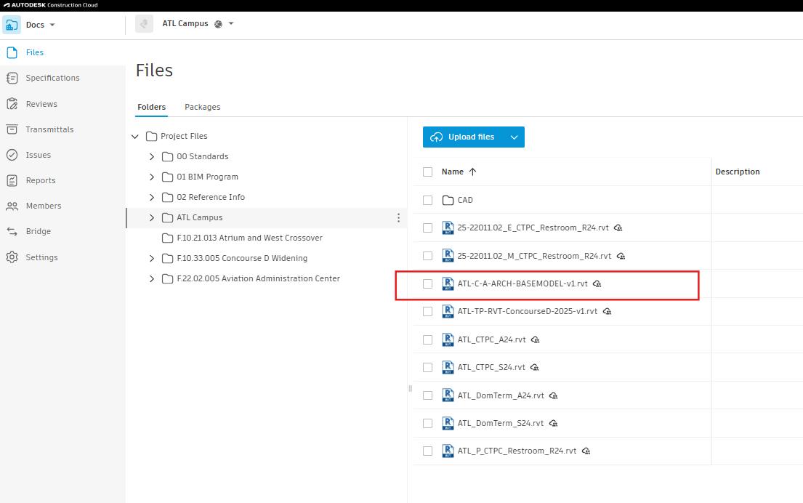

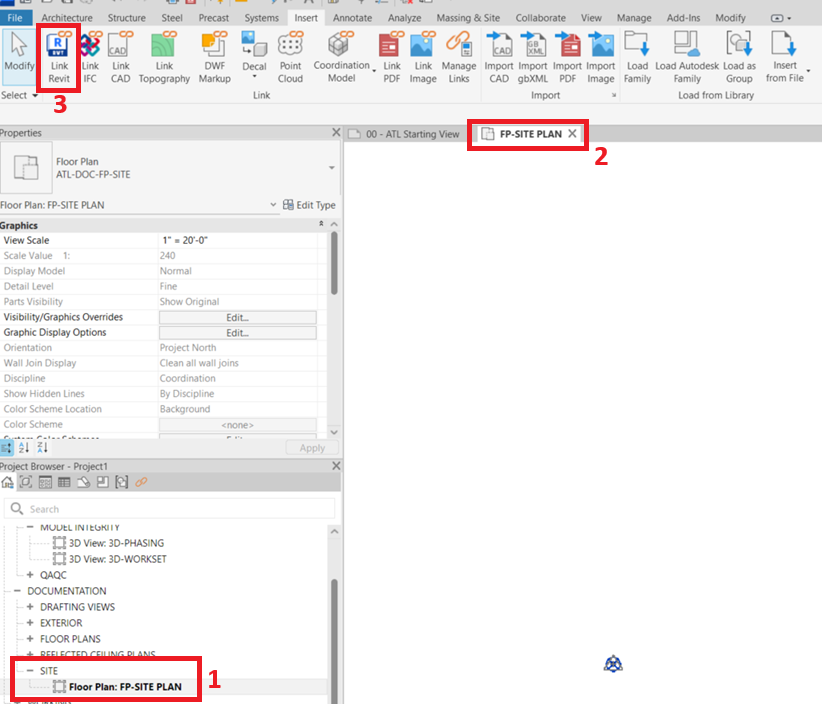3. Click ‘By Host View’ (Fig: 8)  

Figure 8: Visibility/Graphic Overrides settings for ATL-DOC-FP-SITE with 'By Host View' display setting selected

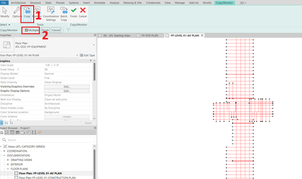4. Basics> Custom

Figure 9: RVT Link Display Settings with 'Custom' option selected

  
5. Go to import categories > Click on the dropdown > select custom> OK (Fig 10 - 1 & 2)  
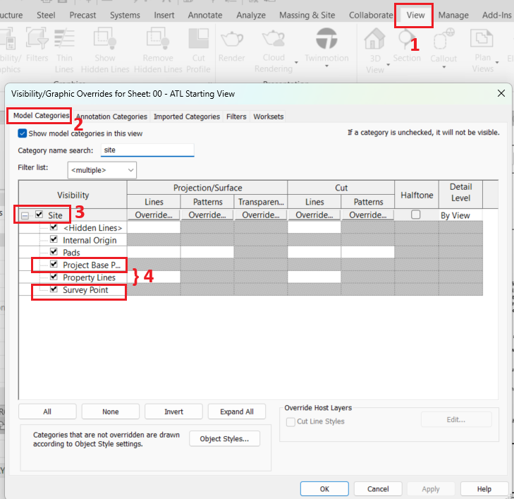
6. Check (Tick) “xcv-basemap.dwg” (Fig 10 - 3)  

Fig 10: RVT Link Display Settings - Import Categories with 'xcv-basemap.dwg' checked

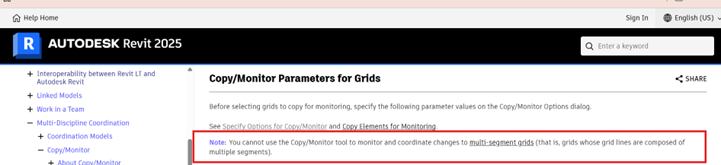
7. The Site Plan view now shows the linked model   

Fig 11: Site Plan view now showing the linked Revit model for the selected concourse.

## Acquiring Coordinates

1. Ensure that the Project Base Point and Survey Point are visible in the view:

- Go to the View tab (Fig 14 – 1)
- Click on Visibility/Graphics (or press VG)
- In the Model Categories tab, scroll down to Site (Fig 14 – 2 & 3)
- Check the boxes for Project Base Point and Survey Point (Fig 14 – 4)
- 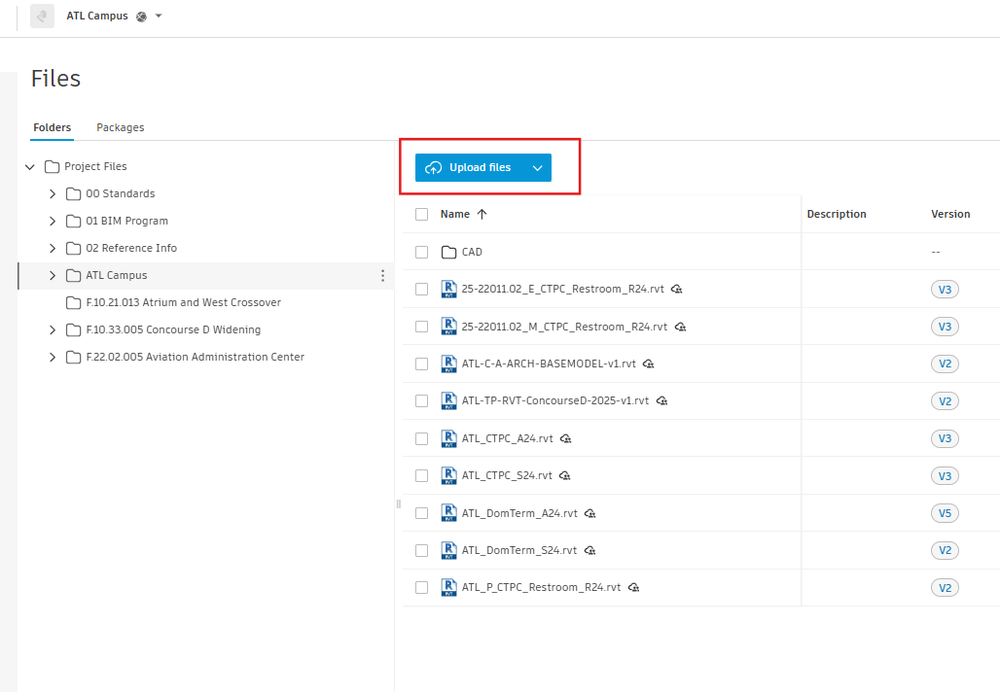Click OK  

Fig 12: Visibility/Graphics Overrides settings

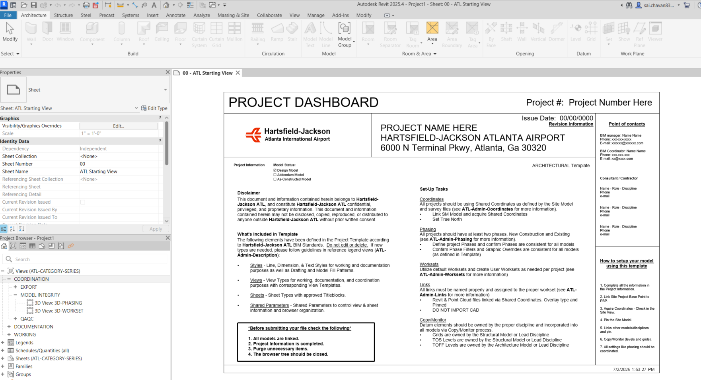

Fig 13: Manage Coordinates in Revit

1. Use Manage > Coordinates > ‘Acquire Coordinates’ (Fig 13)
2. Select the linked site model
3. This sets up the shared coordinate system to match the airport master site model
4. You will get a pop-up showing, "Acquire Coordinates Succeed."(Fig 14 – 1)
5. 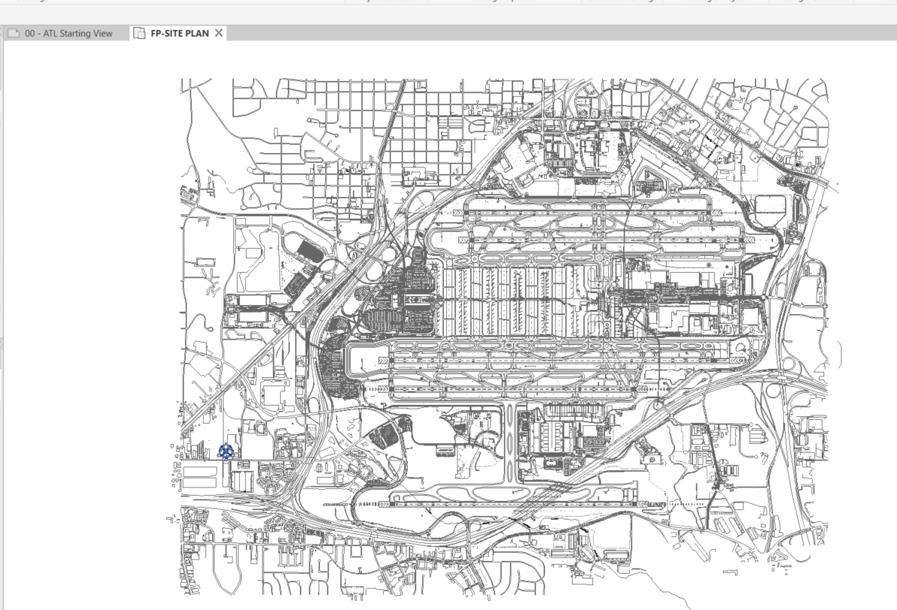  Verify that the GIS Coordinates are set to "ATL\_02"(Fig 14 – 2)

Fig 14: Coordinates acquired from ATL-TP-RVT-ConcourseA-2025-v1.rvt

## Copy/Monitor Grids

Use Copy/Monitor > Select Link (site model or another discipline model with grids)

1. 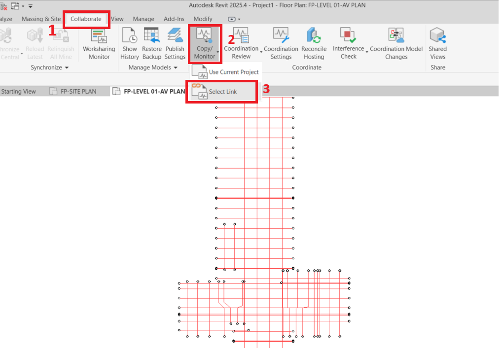Open Floor Plan by double-clicking the floor plan as highlighted in Fig: 15  
  

Fig 15: Opening FP-LEVEL-01-AV PLAN in Autodesk Revit

2. Use Copy/Monitor:

- Click on the ‘Collaborate’ tab (Fig 16 – 1)
- Click on the ‘Copy/Monitor’ button (Fig 16 - )

3. Select Link:

- Choose ‘Select Link.’ (Fig 16 – 3)
- Select the model containing the required grids and levels - 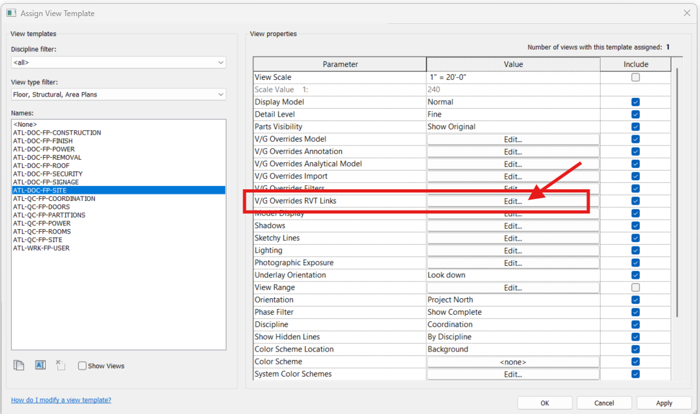
Select and copy the required grids and level

Fig 16: Using the Copy/Monitor tool

4. Copy the required grids and levels:

- Click on the Copy button. (Fig 17 -1)
- 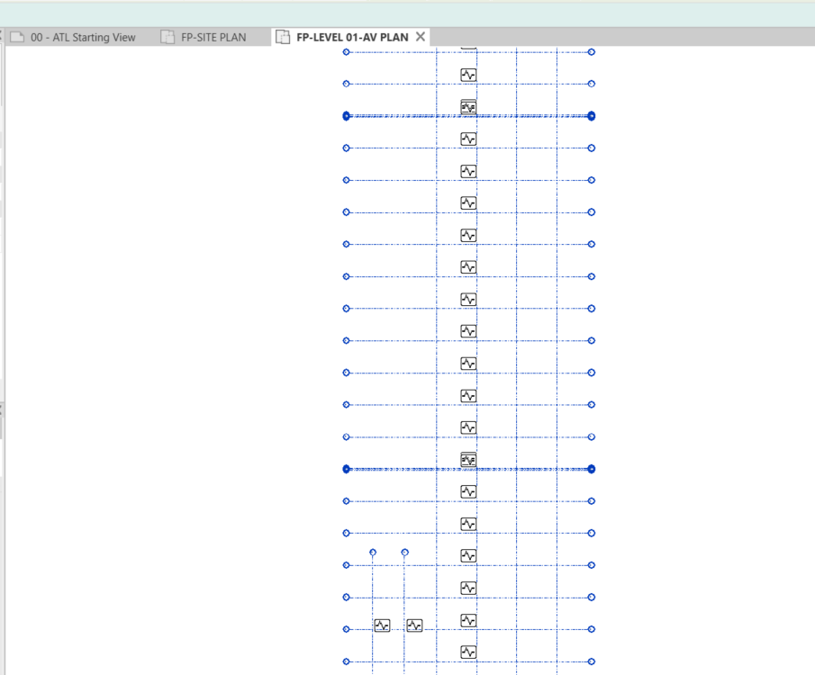
Ensure the ‘Multiple’ checkbox is selected if you need to copy multiple elements. (Fig 17 -2)

Fig 17: Copying multiple elements using the Copy/Monitor tool

- 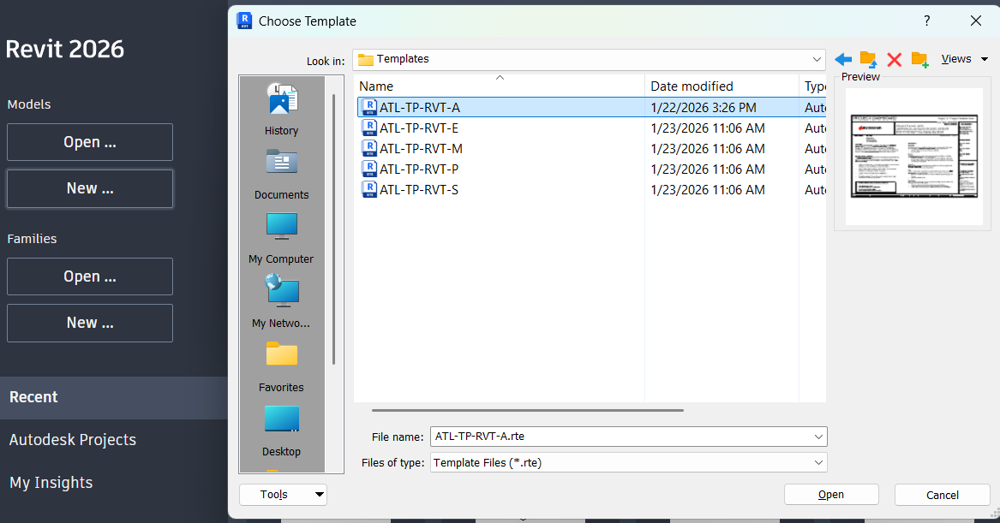
Once all required grids and levels are selected, click the Finish button. (Fig 18)

Fig 19: First-floor plan view in Revit after completing the Copy/Monitor process

Fig 18: Finalizing the Copy/Monitor process

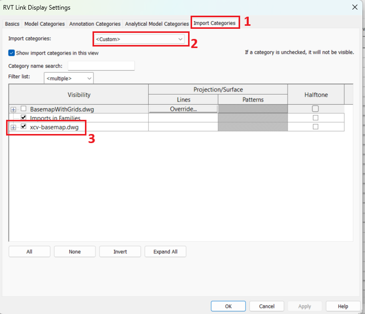  

__Note:__ You cannot use Copy/Monitor and coordinate changes to multi-segment grids  
  
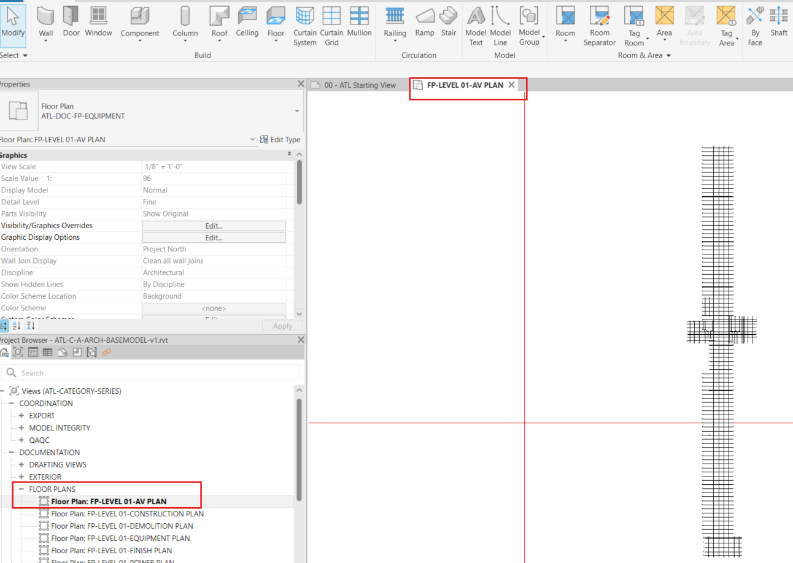

Fig 20: Copy/Monitor tool not applicable for multi-segment grids

  

•	Modify grid names, if necessary, based on the ATL standard naming format  

## Save Central Model with Naming Convention

1. Save the file as a Central Model using the ATL naming format:

- Naming Format: ATL-CONCOURSE-DISC-DESC-VERSION.rvt
- Example:
- ATL-C-A-ARCH-BASEMODEL-v1.rvt

1. Option 1 - Enable Worksharing Before Saving

- Enable Worksharing 
- Use Save As > Central Model on your local drive

__Note:__ If the "Make this a Central Model after save" option is grayed out, follow Option 2.  

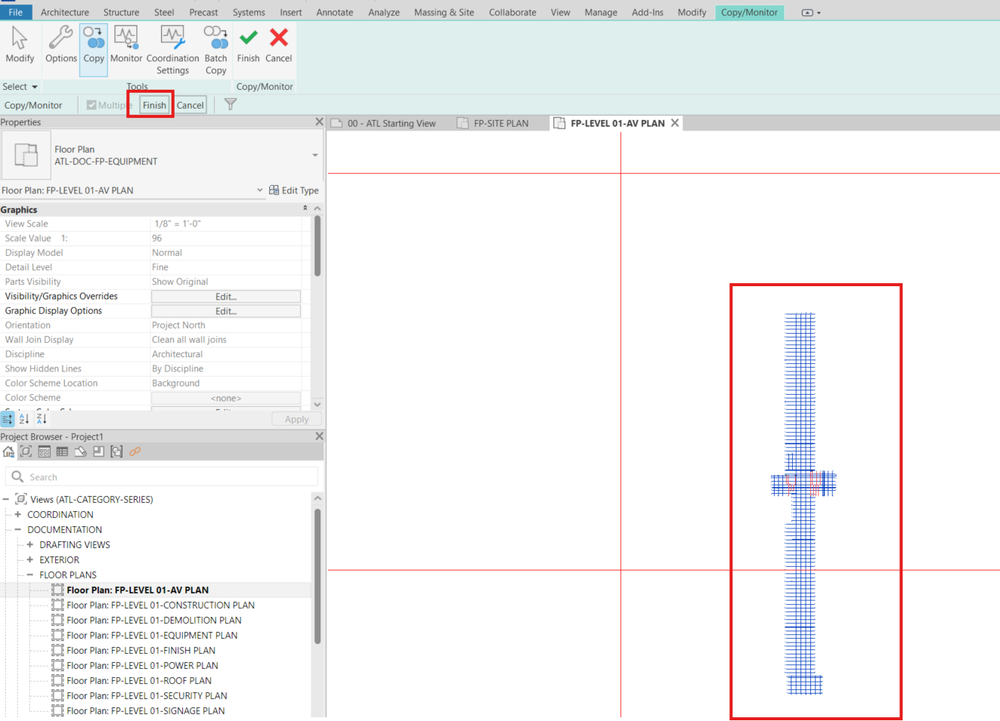Option 2 - Upload a Workshared Model to Autodesk Docs (Revit Cloud Worksharing)

Fig 21: File Save Options dialog box with 'Make this a Central Model after save' option grayed out

- In Revit, open or create a model.
- Click Collaborate tabManage Collaboration panel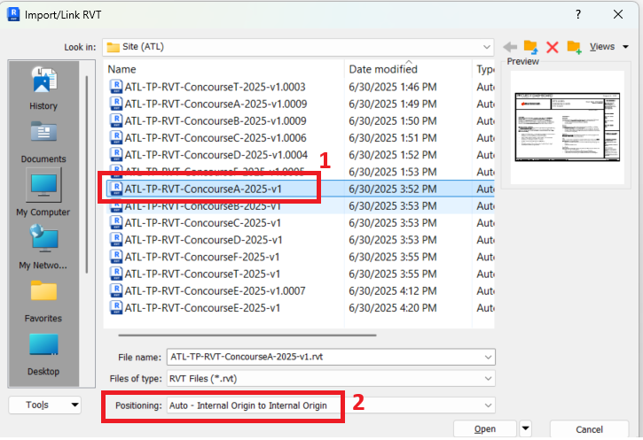 (Collaborate).
- If prompted, [sign into](https://help.autodesk.com/view/RVT/2025/ENU/?guid=GUID-D0692D1B-2654-40B5-A2E2-072253BA77EA) your Autodesk account.

__Note:__ When you sign in, your Revit username changes to match your Autodesk ID.

- In the Collaborate dialog, select In the cloud.
- Click OK.
- Select the desired project folder.
- In the dialog, click Initiate.

Revit displays information about the status of the initiation process.

- Click Close to continue.
- If you subscribe to notifications in Autodesk Docs, you receive an email when your model is successfully published to cloud.
- If the uploaded model includes links, [migrate the linked models to Autodesk Docs](https://help.autodesk.com/view/RVT/2025/ENU/?guid=GUID-AD6E6E45-B9C1-4C43-B5F3-2D171540B34F).

__Note:__ After a model has been workshared, the Autodesk Docs project is only visible to the release of Revit the model was shared from. Cloud models can only be linked to other models shared using the same release.  
  
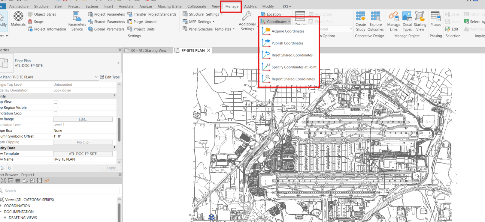  
__Note:__ Check if the Model is already in the ACC, if not, follow steps below – 

Fig  22: Cloud Model saved successfully with worksharing enabled

## Upload to ACC (Autodesk Construction Cloud)

1. Open ACC

From the dropdown menu, select ‘Docs’ (see Figure 23-1)

1. Select the appropriate project

- In this example, Atlanta Campus is selected (see Figure 23-2)

Ensure appropriate folder permissions are set, upload the Central Model to ACC under the correct project folder and discipline  
  

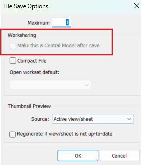

Fig 23: Navigating Projects in Autodesk Construction Cloud (ACC)

1. Click on ‘Upload Files’ 

- A dialog box will appear prompting you to either drag and drop files or upload them from your computer.

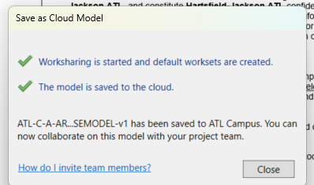

Fig 24: Upload Option in ACC

 

1. Choose your upload method

- You can drag files directly into the dialog box or click ‘from your computer’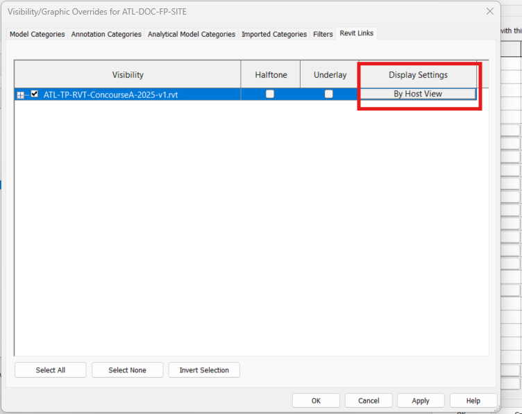

1. Complete the upload

- Once the file upload is finished, click ‘Done’.

Fig 25: Uploading ATL-C-A-ARCH-BASEMODEL-v1.rvt to ATL Campus project

 

1. Verify upload

- 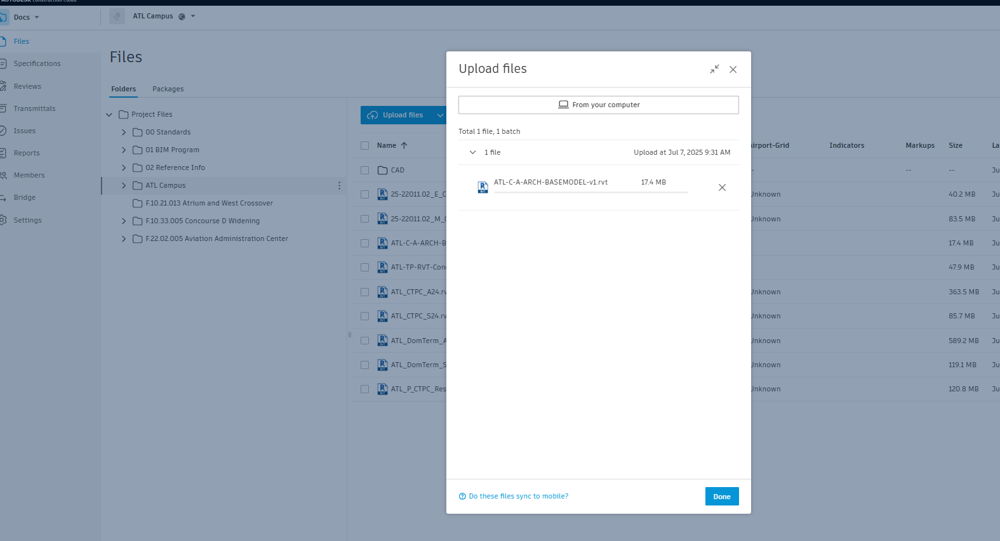The project file will now appear in the folder you selected.  

Fig 26: File successfully uploaded to ATL Campus project in ACC

•	Publish the model if required

## Link Other Discipline Models

•	Link in other models by discipline (ARCH, STR, MEP, FP, etc.)

•	Use Revit Links > By Share Coordinates

•	Check Manage Links to verify coordination settings

## Result:

Your project is:

•	Using the correct discipline-specific template

•	Located and coordinated by concourse

•	Connected to the master site model

•	Following the ATL BIM standards for naming and worksharing

•	Hosted in ACC and ready for multidisciplinary collaboration

