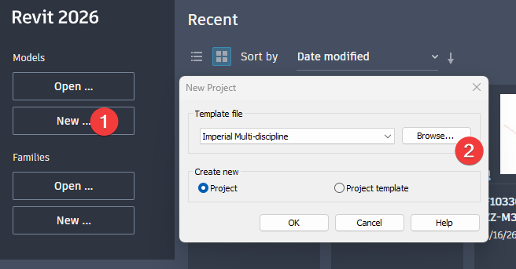
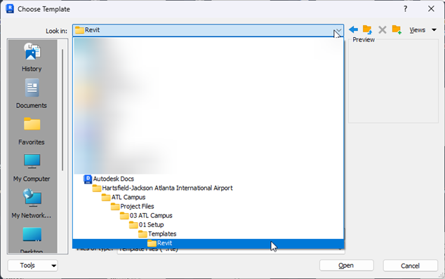
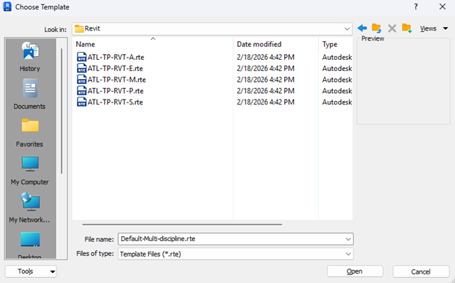
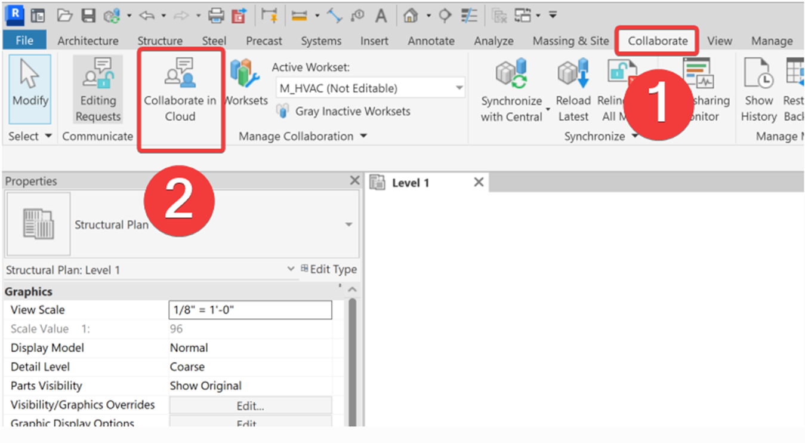
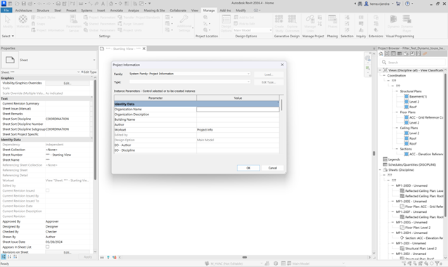

# ATL-STD-XX-DC-GN-004: Revit SOP
 
!!! info "Document Information"
    **Standard ID**: DC-GN-004  
    **Version**: 1.0  
    **Last Updated**: 2026-03-27  
    **Status**: Active
 
---
 
## 2 INTRODUCTION
 
### 2.1 Purpose
 
The purpose of this Standard Operating Procedure (SOP) is to establish a consistent, efficient, and high-quality Revit delivery workflow for the Atlanta Airport. This document defines clear roles and responsibilities, outlines required project setup practices, and standardizes model structure, data management, documentation methods, and model health expectations.
 
By unifying these practices across all projects, the SOP ensures:
 
- Predictable and repeatable model quality.
- Improved coordination across disciplines.
- Reduced rework and production inefficiencies.
- Reliable data for downstream uses.
- Alignment with ATL BIM standards.
This SOP serves as a reference for all team members involved in model authoring, federation, coordination, quality control, and project delivery, supporting a shared understanding of processes and expectations throughout the project lifecycle.
 
In the event of any conflict between the requirements of this document and those outlined in the BIM Standards or the BIM Naming Convention, the BIM Standards and the BIM Naming Convention shall take precedence. These documents supersede any conflicting information contained herein and shall be considered the primary sources of direction.
 
---
 
## 3 ROLES AND RESPONSIBILITIES
 
This section defines the key roles involved in Revit-based project delivery and outlines their core responsibilities. The intent is to ensure clarity, accountability, and consistency across all teams, regardless of discipline or technical background.
 
### 3.1 BIM Manager / BIM Lead
 
**Purpose:**
 
Provides leadership, governance, and oversight for all Revit and BIM related workflows across a project or program.
 
**Key Responsibilities:**
 
- Define, implement, and maintain Revit workflows and standards.
- Ensure models adhere to client requirements, templates, naming conventions, LOD expectations, and BEP standards.
- Coordinate multidisciplinary teams to ensure models are aligned, data-rich, and compliant.
- Oversee model federation strategies and shared coordinate management.
- Support efficiency through automation, scripts, and optimized processes.
- Lead model health reviews and ensure consistent model management practices.
- Act as the primary point of contact for BIM related issues, training needs, and escalations.
**Who this role supports:**
 
Design teams, discipline leads, project managers, and any groups interacting with coordinated BIM models.
 
### 3.2 BIM Coordinator
 
**Purpose:**
 
Ensures technical and procedural alignment across Revit models and coordinates design data across disciplines.
 
**Key Responsibilities:**
 
- Guide teams in following BIM processes and procedures.
- Manage coordination workflows such as clash detection, model alignment, and shared coordinates.
- Verify that Revit models meet internal and client BIM requirements prior to major deliverables.
- Facilitate model exchanges and cross-discipline collaboration.
- Support teams in maintaining accurate, structured, and efficiently segmented models.
- Monitor adherence to model breakdown structures, federation strategies, and naming conventions.
### 3.3 BIM Modeler / Designer
 
**Purpose:**
 
Creates discipline-specific Revit models that are accurate, coordinated, and compliant with project standards.
 
**Key Responsibilities:**
 
- Model architectural, structural, mechanical, electrical, or other discipline elements using approved Revit templates and content.
- Ensure all modeling aligns with ATL standards, LOD requirements, BEP guidance, and client-specific rules.
- Maintain model health through cleanup tasks, resolving clashes, purging, fixing warnings, and optimizing file size.
- Coordinate closely with other modelers and designers to ensure elements align properly across disciplines.
- Input and maintain correct data inside model elements to support schedules, quantities, and downstream uses.
- Assist with setup and maintenance of Revit models, including linking, worksharing, and template usage.
**Qualifications:**
 
- Revit and ACC/BIM360 proficiency.
- Understanding of discipline-specific design requirements and workflows.
- Familiarity with ATL templates, families, and shared parameters.
### 3.4 Engineers (Discipline Engineers)
 
**Purpose:**
 
Ensures that engineering intent, analyses, and performance data are correctly represented within Revit models.
 
**Key Responsibilities:**
 
- Integrate calculation outputs, analysis data, and technical inputs into the Revit model.
- Validate that model content accurately reflects engineering requirements and design decisions.
- Work with modelers and BIM Coordinators to ensure coordinated, constructible, and maintainable design outputs.
- Use approved workflows and tools developed by the BIM Management team to reduce errors and improve accuracy.
- Review model elements for technical correctness, code compliance, and functional relationships.
### 3.5 Project Team Members Using Revit (General Contributors)
 
**Purpose:**
 
Supports project delivery through consistent, responsible Revit use.
 
**Key Responsibilities:**
 
- Follow all approved BIM and Revit standards, including templates, content libraries, and file handling rules.
- Collaborate using ACC (e.g., correct uploading, versioning, and permissions).
- Use shared coordinates and linking protocols as defined by BIM leads.
- Seek support from BIM Coordinators and/or BIM Leads when procedural or technical issues arise.
- Participate in reviews, quality checks, and model coordinator workflows as needed.
> **"If responsibilities aren't clear, quality collapses."**
 
---
 
## 4 PROJECT SETUP
 
This procedure defines how all project teams create and configure Revit project files using approved templates, establish worksets, and set up shared coordinates so models are consistent, coordinated, and compliant with program standards.
 
### 4.1 Pre-Requisites
 
- **Software/Services:** Use the approved Revit and ACC/Desktop Connector versions communicated for the program.

NOTE: Revit files are not backward compatible. A model created or saved in a newer Revit version (e.g., 2026) cannot be opened in an older version such as Revit 2025. All project teams must verify and align to the required Revit version prior to starting any modeling activities.
 
| Software | Version |
|----------|---------|
| Revit 2026 | 26.4.0.32 |
| Desktop Connector | 17.0.1.3021 |
 
- **Access:** Confirm project access to the ACC site and to the Standards/Templates folders.
- **Standards:** Please refer to the BIM Standards document.
- **Plugins:** Discipline teams are allowed to use plugins, add-ins, or scripts that will help them create the models at their own risk.
### 4.2 Using the Revit Templates (Mandatory)
 
Project templates come preloaded with title blocks, view templates, parameters, sheets, and discipline-specific settings to ensure teams model consistently and maintain efficiency throughout the project.
 
#### 4.2.1 Procedure – Create the Project from Template
 
1. Start Revit and select **New**.

  
   
  <em>Figure 1 - Revit New Project dialog</em>

2. From the pop-up window, select **Browse**.
3. Navigate to the templates location and pick the correct discipline template (e.g., Architectural / Structural / Mechanical / Electrical).

  
   
  <em>Figure 2 - Choosing templates with desktop connector</em>

  
   
  <em>Figure 3 - Choosing template</em>

4. **Collaborate in the Cloud:** Use **Collaborate > In Cloud** to publish to the designated ACC project folder.

  
   
  <em>Figure 4 - Enabling Worksharing</em>

5. **Project Information:** Populate the "Project Information" parameters required by the template.

  
   
  <em>Figure 5 - Project Information</em>

6. **Content Verification:** Confirm title blocks, view templates, line weights, text styles, and sheet naming match the standards.

### 4.3 Worksets – Planning and Creation
 
Worksets manage visibility, performance, and ownership across teams. A clean, consistent scheme prevents clashes, improves performance, and simplifies publishing.
 
#### 4.3.1 Procedure – Establish Worksets
 
1. Open the cloud model and enable Worksharing if not already enabled. (See Figure 4)
2. Create Core Worksets following the Naming Convention for Worksets:
    - "Workset 1" (Created by default — do not delete or rename)
    - "Shared_Levels_Grids" (read-only by default)
    - "Links_Revit_[Discipline]" (e.g., "Links_Revit_Arch_001")
    - "Links_CAD_[Discipline]" (e.g., "Links_CAD_Civil")
    - "Scope_Boxes"
3. Set the appropriate active workset for each modeling task; avoid placing elements on link or shared-control worksets.

  
   
  <em>Figure 6 - Worksets Selection</em>

#### 4.3.2 Workset Standards
 
Worksets must be established at the start of each project to organize model elements, improve performance, and support multi-discipline collaboration. The BIM Lead creates and publishes the approved workset list in the project template. Each discipline must use these worksets exactly as provided and assign elements correctly while modeling.
 
**Procedure:**
 
- Open the approved project template, which already contains the required worksets.
- Before modeling, confirm that all standard worksets (Architecture, Structure, MEP, Links, Levels/Grids, etc.) are present.
- Place all Revit links on the dedicated links worksets before pinning them.
- As you model, assign each element to its correct discipline workset — do not leave anything on `<None>`.
- When a new system or requirement arises, request approval from the BIM Coordinator before creating additional worksets.
- Use worksets to partially open models for performance (e.g., close heavy MEP systems when not needed).
**Standards:**
 
- Only the predefined worksets in the project template may be used. No new worksets should be created without BIM Coordinator approval.
- All elements must be placed on the correct workset according to discipline or model function.
- Links, levels, grids, and shared elements must always be placed on their respective dedicated worksets.
- Worksets must not be used for visibility control — use view templates instead.
- Workset lists must remain consistent across all discipline models for proper coordination.
- Worksets help improve model performance and loading times and must be closed when not needed.

 
## 5 MODEL SETUP
 
### 5.1 Creating a Central Revit File
 
Once a project has kicked off, a central Revit file will be created for each discipline involved. Each model should adhere to the Atlanta BIM Standards and template format. Refer to [4.2 Using Revit Templates](#42-using-the-revit-templates-mandatory) to add the necessary template to a Revit file.
 
NOTE: Changes to the format of the Revit Model can be made on a project-by-project basis and are subject to BIM approval.
 
**Steps to create a new Revit file:**
 
1. Open a new Revit file and add the desired template. ([4.2](#42-using-the-revit-templates-mandatory))
2. Add the Shared Parameters to the Revit file. ([5.4](#54-shared-parameters))
3. Fill out the necessary information on the Title Sheet.
4. Save the file according to the BIM naming conventions.
5. Workshare the file to Autodesk Construction Cloud. ([5.2](#52-work-sharing-a-central-revit-file))
6. Link in the site model and acquire coordinates. ([5.3](#53-linking-in-a-site-model--acquiring-coordinates))
7. Add Levels & Grids. ([5.5](#55-levels--grids))
### 5.2 Work-Sharing a Central Revit File
 
All Revit model files should be workshared to Autodesk Construction Cloud. This ensures the BIM and project teams can properly coordinate, mark up, and edit files as a project progresses.
 
NOTE: **No active project files should be saved locally.** Every file should be workshared to Autodesk Construction Cloud.
 
**Steps to workshare a Revit file:**
 
1. Save the file locally with the proper naming convention. Make sure to save the file as a central model.
2. In the **Collaborate** tab, select **Collaborate in Cloud**.
3. If prompted, select **Share to Cloud** — not on a local network.
4. Select the project's ACC site and the folder location for the file.
5. Click **Save**.
6. The file is now workshared to the cloud and can be edited. When finished, synchronize the file and relinquish elements.
7. Publish the edited model.

### 5.3 Linking in a Site Model & Acquiring Coordinates
 
All Revit models should be geolocated according to the Atlanta Airport's official coordinate system as required in the BIM Standards document. The Site Models in the ATL Campus contain the ATL02 "Airport Grid Coordinates."
 
NOTE: Each team **must** verify the coordinates, position, rotation, and elevation as a new model is set up.
 
**Steps to link a Site Model:**
 
1. Create a Floor Plan at the Foundation or Apron level and name it **"ACC – Grid Reference"**.
2. In the Ribbon, select **Insert**, then **Link Revit**.
3. In the **03 ATL Campus** folder, go to the **Site Models** subfolder and select the desired Facility Site Model.
4. Select **Origin-to-Origin** and load the link.
5. In **Visibility/Graphics**, ensure the Project Base Point, Origin, and Survey Point are visible. Turn off visibility for all other model elements.
6. Check that the origin point for the linked site model loads at the same location as the file's origin point. If using grids from a previous model, verify that the site model grids are aligned with the model grids.
7. In **Visibility/Graphics**, set the linked view to the site view.
8. Create a section view and name it **"ACC – Elevation Reference"**. Ensure that the section box extends to the grids and survey points.
9. Make sure the site model's apron/foundation level is aligned with the first level for your model. Pin the Site Model.
10. In the Ribbon **Manage** tab, reset the shared coordinates.
11. Click **Acquire Coordinates** and select the site model.
12. Move the survey point of the model to sea level (x=0, y=0, z=0). Pin it in place.

### 5.4 Shared Parameters

Shared parameters are used by the BIM team to manage and collect data on model elements. All discipline models should apply the ATL Shared Parameters to their models.
 
**WARNING:** Edits to the ATL Shared Parameters may **only** be made by the ATL P&D BIM Team and are subject to review.
 
**How to add the shared parameters:**
 
1. Download the shared parameters from the ATL Campus.
2. Open the Revit model.
3. In the Ribbon **Manage** tab, select **Shared Parameters**.
4. Browse and select the ATL Shared Parameters file.
5. Once the file has loaded, go to **Project Parameters**.
6. Add all necessary parameters to the Revit file.
**How to create shared parameters:**
 
1. In an open Revit file, select **Shared Parameters**.
2. If adding to ATL's shared parameters, browse and select the ATL Shared Parameter `.txt` file. If creating a new file, select **Create** and add a blank `.txt` to Revit.
3. Select **New Group** and name it according to the type of data being collected.
4. Once the group has been created, select **New Parameter** and add the desired parameters.
5. Click **OK** to save the new parameters.
6. Open the `.txt` file separately and verify that all parameters have been properly added.
7. Save the file locally.
8. Once all new parameters have been added and checked, upload the updated shared parameter file to the ATL Campus. Archive/consume the older `.txt` file.
### 5.5 Levels & Grids
 
Levels and grids form the primary datum system for all disciplines and must be established early and remain consistent throughout the project. The BIM Coordinator/Manager is responsible for creating and maintaining the master set based on approved project geometry. No other discipline should modify them without formal approval.
 
The Site Models contain levels and grids set at their proper elevation level (1,000'+). Project teams should reference the site models when setting up their Revit model.
 
### 5.6 Copy / Monitor
 
To ensure alignment, Copy/Monitor can be used to bring levels and grids into discipline models. Any resulting inconsistencies or warnings must be resolved promptly in coordination with the BIM Lead.
 
**Procedure to use Copy/Monitor:**
 
1. Link in the model with elements that need to be copied. Apply the steps from [5.3 Linking in a Site Model & Acquiring Coordinates](#53-linking-in-a-site-model--acquiring-coordinates). Only link and align — do not reacquire coordinates.
    *Add Picture*
2. Use **Copy/Monitor → Select Link** to copy all required levels and grids into your file.
    *Add Picture*
    *Fig. 8 – Copy/Monitor grids*
!!! note
    Review and resolve Copy/Monitor warnings right away and notify the BIM Lead if something doesn't match.
 
**How to resolve Copy/Monitor warnings:**
 
- When Architecture updates levels or grids later in the project, reload the link, run **Coordination Review** again, and accept or reject changes as instructed.
!!! warning
    Do not use multisegment grids. Multisegment grids do not support Copy/Monitor, which means other disciplines will not receive notifications when grids move.
 
### 5.7 Linked Models
 
**Why:** Linked models are used to coordinate multiple disciplines while keeping each team's work separate and manageable. At the start of each project, each team must link the master Architectural model into their file, followed by Structural and MEP models as they become available. All links must be inserted from the approved shared ACC folder, placed on their dedicated workset, and use shared coordinates.
 
!!! warning
    Teams must never link models from local paths or edit coordinates on their own. When updates occur, links must be reloaded, checked for alignment, and verified through coordination review to ensure consistent spatial accuracy across the project. If there is a need to use an outdated model, use the **Consumed** linking method.
 
**Procedure to Live Link:**
 
1. Go to **Links**.
2. Select the link from the **WIP** folder for the discipline you wish to link.
**Procedure to Shared Folder Link:**
 
1. Go to **Links**.
2. Select the link from the **Shared** folder for the discipline you wish to link.
3. Navigate to **Insert → Link Revit** and select the required model from the approved ACC Shared folder.
4. Link the model through shared coordinates once the BIM Coordinator establishes the coordinate system.
5. Place all links on their designated **LINKS** workset before pinning them.
6. Reload links only after models are officially published to the Shared folder — not from local or outdated sources.
7. When new disciplines join the project, follow the same linking process to maintain consistent alignment.
**Procedure to Consumed Folder Link:**
 
1. Go to **Design Collaboration** and select your discipline/model.
2. In Design Collaboration, consume the latest packages from each discipline.
3. In Revit, go to **Links**.
4. Select the link from your consumed folder for the discipline you wish to link.
### 5.8 Discipline Model Segregation
 
*[Content to be added]*
 
### 5.9 View Organization Structure
 
ATL Templates come with the recommended project browser structure. You may edit it as needed for your project.
 
### 5.10 Model Phasing and Design Options
 
Use phasing; avoid using design options. You should have at least three phases:
 
- Existing / Legacy
- Demolished
- New
**Steps to apply phases:**
 
*[Content to be added]*
 
**Steps to apply design options:**
 
*[Content to be added]*
 
---
 
## 6 MODELING STANDARDS
 
### 6.1 Category-Based Modeling Rules
 
**Why:** Using correct categories ensures that all elements behave as expected in schedules, tags, filters, and coordination views. Elements must maintain modeling tolerances without unnecessary manual offsets to maintain consistency and alignment across all models.
 
!!! note
    Do not use generic models or in-place families without prior approval from the BIM Coordinator.
 
**Steps to assign a category to a generic model:**
 
*[Content to be added]*
 
### 6.2 Geometry Standards
 
**Detail Level Usage (Coarse / Medium / Fine):**
 
Depending on the LOD for the specific model, select the appropriate view detail level.
 
*Add a picture*
 
**Basic Clearance and Maintenance Space Modeling:**
 
Geometry within the model shall be developed to support design intent, coordination accuracy, and overall model performance. Excessive or unnecessary geometric complexity shall be avoided to ensure stable performance, visibility, and consistent behavior across all views and project phases.
 
- Utilize view templates and filters to manage object visibility rather than hiding elements individually in each view.
**CAD File Use:**
 
- Remove imported CAD files after use; place only in required working views and never explode them.
    *Picture showing the "Show Only on This View" checkbox*
- Never explode a CAD file.
    *Add a picture of the explode tool with a warning*
- Regularly use the **Purge Unused** command to remove unnecessary families and types, reducing file size.
- Replace complex, modeled details with Drafting Views.
**Etransmit Process:**
 
1. Select the model.
2. Select the folder where you want the final cleaned-up model to go.
3. *[Additional steps to be added]*
### 6.3 Family Usage Standards
 
Families must be created and managed in a consistent, controlled manner to maintain model stability, accurate coordination, and predictable graphical behavior. The correct family type should be used based on the required function, level of detail, and modeling purpose. Unnecessary or overly complex families can degrade performance — especially nested families, which can cause visibility issues and lead to coordination errors. The use of approved standards and disciplined modeling practices is therefore essential.
 
#### 6.3.1 General Modeling Guidelines
 
- Use reference planes to control geometry and lock all critical dimensions using constraints.
- Keep geometry simple and lightweight. Avoid unnecessary 3D modeling where 2D elements can achieve the same result.
- Use visibility settings as needed: Coarse for simplified geometry, Medium for moderate detail, and Fine for full detail.
- Regularly flex families to check that parameters behave correctly under different conditions.
#### 6.3.2 Family Type Usage
 
- Use **System Families** (walls, floors, roofs, ceilings, ducts, pipes) for elements that interact with Revit systems.
- Use **Loadable Families** for components like furniture, equipment, fixtures, and specialty items.
- Do not edit system families directly — always duplicate and rename per standards before modifying.
- Avoid **in-place families**: they increase file size and cannot be reused. If their use is unavoidable for highly project-specific geometry, ensure they are kept simple, limited in number, and reviewed before inclusion in the model.
- **Control family complexity:** Limit the use of nested families as they can create visibility issues and make troubleshooting difficult. Keep families simple, stable, and easy to manage.
- **Ensure proper MEP functionality:** All MEP families must have correctly configured connectors with accurate system classification, flow direction, sizing parameters, and proper connection behavior, supporting system calculations where required.
### 6.4 Modeling Warnings & Error Handling
 
Although not all Revit warnings are immediately harmful, they reflect the overall health of the model. When left unresolved, they accumulate and lead to coordination issues, unstable behavior, and unreliable outputs. In large or federated projects, this directly impacts clash detection and system performance. Warnings must be managed continuously to keep the model clean, stable, and dependable.
 
#### 6.4.1 Warning Management and Acceptance Criteria
 
- Review warnings regularly during modeling — do not leave them for submission or publishing stages.
- Model authors are responsible for resolving their warnings; the BIM Coordinator monitors trends and recurring issues.
- Repeated warnings must be addressed at the workflow level, not treated as isolated mistakes.
- Maintain a low and controlled warning count; high warning levels indicate poor model health.
- Resolve all critical warnings before coordination, publishing, or model sharing.
- Priority warnings include: overlapping/duplicate elements, room enclosure issues, constraint problems, incorrect joins, etc.
- Models with unresolved critical warnings may be rejected or require cleanup before use.
Validate after correction by checking room boundaries and quantities, and ensuring the warning is cleared before proceeding with coordination or publishing.
 
### 6.5 Model Performance Rules
 
Model performance must be maintained throughout the project to ensure stability, efficient navigation, and compliance with ATL BIM Standards. All disciplines must manage file size, cleanup routines, modeling techniques, and workset usage proactively so project models remain lightweight, responsive, and suitable for coordination and review.
 
**Best Practices:**
 
- Keep RVT file sizes within acceptable project thresholds by purging unused content and compacting the model regularly.
- Follow a purge/compact schedule (e.g., weekly or prior to major submissions) to remove unused families, materials, and imported content.
- Use lightweight modeling techniques: avoid overly detailed geometry, simplify families, and replace complex modeled details with drafting views.
- Manage worksets so heavy geometry is isolated and can be unloaded when not needed.
---
 
## 7 DELIVERABLES AND EXPORTS
 
### 7.1 Quality Assurance for Deliverables
 
*[Content to be added]*
 
### 7.2 Publishing Sets
 
A **publish set** in Revit is a saved selection of sheets and views intended to be published to ACC for review. It helps control what gets shared so the team doesn't accidentally publish the full model, miss sheets, or share working views that were not meant for coordination. Once created, the same selection can be reused each time the model is published, keeping the process consistent.
 
**Procedure:**
 
1. Open the required cloud workshared Revit model and navigate to **Publish Settings**.
    *Screenshot*
2. Create a **New Set**.
    *Screenshot*
3. Select the sheets and views intended to be published. Click **Save & Close**.
    *Screenshot*
4. **Synchronize with Central**.
    *Screenshot*
5. On the Revit Home Screen, select the model and click **Publish Latest**.
    *Screenshot*
#### 7.2.1 Requirements and Controls
 
- Only approved and coordinated content shall be included in the publish set.
- Publish sets must be reviewed before each publish to ensure completeness.
- Set names shall be clear and consistent with project milestones.
- Do not assume new sheets are automatically included — sets must be updated manually.
#### 7.2.2 Best Practices
 
- Create sets based on purpose (coordination, submission, client review) rather than random selection.
- Reuse saved sets to avoid missing or incorrect sheets during publishing.
- Update sets whenever new sheets are added to the project.
- Always verify the set before publishing to prevent coordination issues.
- Keep publish sets clean — if content is not meant to be seen outside the team, it should not be in the set.
### 7.3 Exporting NWCs and NWDs
 
NWC and NWD files are used to share coordinated models for review and clash detection in Navisworks.
 
- An **NWC** is a cached/exported file from Revit used for active coordination and is regularly updated.
- An **NWD** is a published, read-only file used to share a fixed snapshot of the model with the wider team.
Using both correctly ensures teams are coordinating with the latest data while also maintaining controlled deliverables.
 
#### 7.3.1 Best Practices
 
- Maintain a dedicated coordination view for consistent NWC exports across all disciplines.
- Ensure NWC files are updated regularly to reflect the latest model changes before coordination.
- Avoid exporting unnecessary elements to keep coordination models clean and efficient.
- Use NWD files for review and issue — not for active coordination workflows.
- Maintain clear version control and traceability of coordination files in line with project requirements.
#### 7.3.2 Procedure
 
1. Make sure you are in the required 3D coordination view (only elements visible in this view will be exported).
2. Go to **File → Export** and select the appropriate NWC format.
---
 
## 8 LEVEL OF DEVELOPMENT (LOD)
 
All project models must follow the LOD requirements defined in the **project's BIM Execution Plan (BEP)**. The LOD targets below represent the minimum mandatory model maturity at Construction Start and As-Built Closeout. These requirements override any generic industry definitions and apply to every discipline delivering models on this project.
 
Please refer to the BIM Standards for the LOD definition and the specific requirements for each submission.
 
**Process to reach LOD 350:**
 
- At the beginning of the project, use **LOD 200** for Schematic Design.
- Once approved, incorporate more information to reach **LOD 250**, with size, location, load, etc. defined.
- As Design Development approaches, improve modeling to **LOD 300**, incorporating details such as connections.
- For Construction Documents, all elements should be at the maximum level of detail possible.
*LOD table — to be added*
 
**Requirements:**
 
| Discipline | Construction Start | As-Built |
|------------|-------------------|----------|
| Architectural | LOD 350 | LOD 400 |
| Structural | LOD 350 | LOD 400 |
| MEP | LOD 350 | LOD 400 |
| Civil | LOD 300 | LOD 350 |
 
**Do:**
 
- Model all elements to the required LOD before each project milestone.
- Ensure penetrations, clearances, routing, and trade interfaces are fully coordinated at LOD 350.
- Update both geometry and parameters to match field-verified conditions for As-Built.
- Use the IDP to populate required asset and system data consistently.
**Don't:**
 
- Don't submit models containing placeholders, schematic geometry, or uncoordinated elements at construction stage.
- Don't add unnecessary fabrication-level detail unless explicitly required in the BEP.
- Don't omit mandatory IDP parameters or leave elements without correct metadata.
---
 
## 9 PARAMETER AND DATA
 
*[Sections to be developed — suggested outline below]*
 
- Metadata standards
- Shared parameters
- Instance vs. type parameters
- Name and classification conventions
- Asset data / LOD
- Process of loading a shared parameter file
---
 
## 10 VIEW CREATION AND DOCUMENTATION
 
*[To be developed]*
 
---
 
## 11 COORDINATION AND CLASH DETECTION
 
**Process to perform clash detection in Revit:**
 
1. Select the elements.
2. Click on the **Interference Check** tool.
3. Export the report.
4. Using the **Select by ID** tool, find the clashing elements.
5. Resolve the clash.
---
 
## 12 MODEL HEALTH & QA/QC
 
- Process for running the Autodesk Validation Tool: *[To be added]*
- Creating schedules to check file metadata: *[To be added]*
---
 
## 13 FILE NAMING CONVENTION
 
*[Content from the TOC references sections 3.1–3.12 in the source document; content to be added here or in a separate naming convention document per the TOC.]*
 
---
 
# Revision Addendum Log
 
This section outlines the document's history and key events.
 
| Revision | Date | Description | Author |
|----------|------|-------------|--------|
| Rev 0 | 08/01/2025 | Document Creation | Chris Harman |
| Rev 1.0 | 02/20/2026 | Adding ACC, Site Model, and Asset Model Naming Standards | Miguel Henriquez |